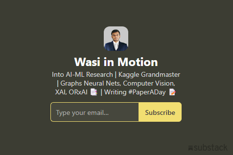

# **#PaperADay** - 13

In the rapidly evolving realm of artificial intelligence, keeping up with the latest research papers can be a daunting task. Yet, for those driven by an insatiable curiosity and a burning passion for AI, staying in touch with cutting-edge developments is not just essential—it's exhilarating. This is hy I started the #PaperADay challenge, a transformative initiative that invites individuals to embark on a journey of intellectual growth by reading one AI paper every single day.

***This repository contains a list papers I read and the reviews.***

---

## **Papers I Read**
| No | Paper Name | Review |
| --- | --- | --- |
| 01| Towards Making Systems Forget with Machine Unlearning | [Review](https://github.com/azminewasi/PaperADay/blob/main/papers/001-Towards-Making-Systems-Forget-with-Machine-Unlearning.md) |
| 02| Fast Segment Anything| [Review](https://github.com/azminewasi/PaperADay/blob/main/papers/002-Fast-Segment-Anything.md) |
| 03| Are Deep Neural Networks SMARTer than Second Graders? | [Review](https://github.com/azminewasi/PaperADay/blob/main/papers/003-Are-Deep-Neural-Networks-SMARTer-than-Second-Graders.md) |
| 04 | ETA Prediction with Graph Neural Networks in Google Maps | [Review](https://github.com/azminewasi/PaperADay/blob/main/papers/004-ETA-Prediction-with-Graph-Neural-Networks-in-Google-Maps.md) |
| 05 | PinnerSage: Multi-Modal User Embedding Framework for Recommendations at Pinterest | [Review](https://github.com/azminewasi/PaperADay/blob/main/papers/005-PinnerSage-Multi-Modal-User-Embedding-Framework.md) |
| 06  | Beyond Audio: Towards a Design Space of Headphones as a Site for Interaction and Sensing | [Review](https://github.com/azminewasi/PaperADay/blob/main/papers/006-Beyond-Audio.md) |
| 07  | Objaverse-XL: A Universe of 10M+ 3D Objects | [Review](https://github.com/azminewasi/PaperADay/blob/main/papers/007-2-Objaverse-XL.md) |
| 08 | Reconstructing the Mind's Eye fMRI-to-Image with Contrastive Learning and Diffusion Priors | [Review](https://github.com/azminewasi/PaperADay/blob/main/papers/007-Reconstructing-Minds-Eye-fMRI-to-Image.md) |
| 09 | Towards Language Models That Can See: Computer Vision Through the LENS of Natural Language | [Review](https://github.com/azminewasi/PaperADay/blob/main/papers/008-Towards-Language-Models-That-See.md) |
| 10| Geometric deep learning on graphs and manifolds using mixture model CNNs | [Review](https://github.com/azminewasi/PaperADay/blob/main/papers/008-2-GDLon-graphs-manifolds-using-mixture-model-CNNs.md) |
| 11 | GeomGCL: Geometric Graph Contrastive Learning for Molecular Property Prediction | [Review](https://github.com/azminewasi/PaperADay/blob/main/papers/009-GeomGCL.md) |
| 12 | Patch n’ Pack: NaViT, a Vision Transformer for any Aspect Ratio and Resolution | [Review](https://github.com/azminewasi/PaperADay/blob/main/papers/11-Patch-n-Pack.md) |
| 13 | Animate-A-Story: Storytelling with Retrieval-Augmented Video Generation | [Review](https://github.com/azminewasi/PaperADay/blob/main/papers/13-Animate-A-Story.md) |
| 14 | AnimateDiff: Animate Your Personalized Text-to-Image Diffusion Models without Specific Tuning | [Review](https://github.com/azminewasi/PaperADay/blob/main/papers/14-AnimateDiff.md) |
| 15 | DeepSIM: Image Shape Manipulation from a Single Augmented Training Sample | [Review](https://github.com/azminewasi/PaperADay/blob/main/papers/15-DeepSIM.md) |
| 16 | Test-Time Training on Video Streams | [Review](https://github.com/azminewasi/PaperADay/blob/main/papers/16-Test-Time-Training.md) |
| 17 | SuperGlue: Learning Feature Matching with Graph Neural Networks | [Review](https://github.com/azminewasi/PaperADay/blob/main/papers/17-SuperGlue.md) |
| 18 | Nerfies: Deformable Neural Radiance Fields | [Review](https://github.com/azminewasi/PaperADay/blob/main/papers/18-Nerfies.md) |
| 19 | Tracking Anything in High Quality | [Review](https://github.com/azminewasi/PaperADay/blob/main/papers/19-TrackingAnythingHQ.md) |
| 20 | LEDITS: Real Image Editing with DDPM Inversion and Semantic Guidance | [Review](https://github.com/azminewasi/PaperADay/blob/main/papers/20-LEDITS.md) |

---

## 📌 If it helped, don't forget to **star** the repo! ⭐⭐⭐⭐⭐

---

</iframe>

---

## ✨ **Credits**
**Azmine Toushik Wasi**

  
  
  
  
 
