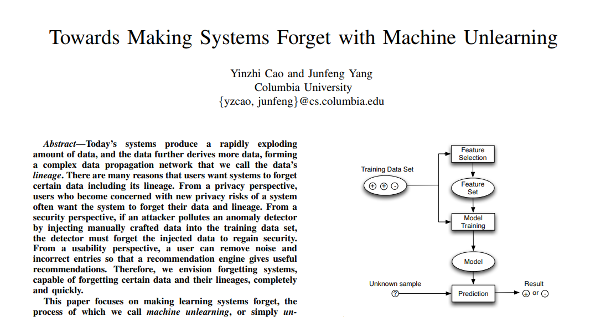

# Paper Review - Day 01

## **Paper Title**: Towards Making Systems Forget with Machine Unlearning
- **Authors**: Yinzhi Cao, Junfeng Yang
- **Paper URL**: https://ieeexplore.ieee.org/document/7163042

---

---

## Summary: 
The method converts algorithms into a summation form for efficiently forgetting data lineage using adaptive and non-adaptive SQ learning. At first, calculated summations and features are given. To forget, data is removed, summations and features are recalculated; top features are noted, and the model is updated accordingly. Summations are used as probabilities to classify and compare with base predictions until the model converges with different features added or sliced in each step.

## Strengths:
- The concept of forgetting systems that restore privacy, security, and usability by forgetting data lineage completely and quickly.
- A general unlearning approach that converts learning algorithms into a summation form for efficiently forgetting data lineage.
- An evaluation of the proposed approach on real-world systems/algorithms demonstrating that it is practical, complete, fast, and easy to use.
- The practical data pollution attacks created against real-world systems/algorithms.

## Weaknesses:
- Low level method
