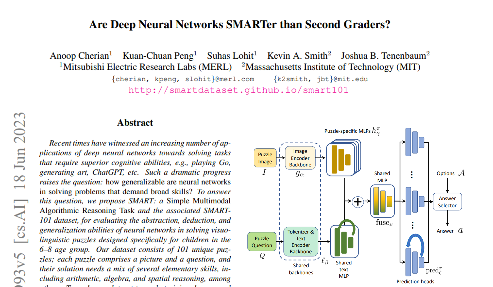
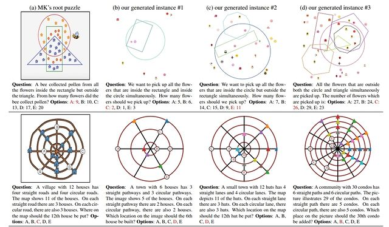
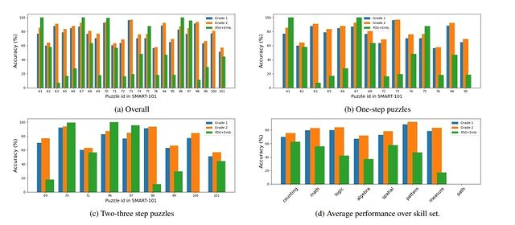

# Paper Review - Day 03

## **Paper Title**: Are Deep Neural Networks SMARTer than Second Graders?
- **Authors**: Anoop Cherian, Kuan-Chuan Peng, Suhas Lohit, Kevin A. Smith, Joshua B. Tenenbaum
- **Publication**: CVPR 2023
- **arXiv**: https://arxiv.org/abs/2212.09993
- **Github**: https://github.com/merlresearch/SMART
- **Papers with Code**: https://paperswithcode.com/paper/are-deep-neural-networks-smarter-than-second

---

---

## 🧾 Summary: 
SMART (Simple Multimodal Algorithmic Reasoning Task) is a deep neural network task that tries to solve visuolinguistic puzzles designed for children in the 6-8 age group. Experiments show that although deep models perform well on puzzles in a supervised setting, they lack generalization ability.

## 🚀 How does it work?
1. SMART task consists of a picture and a question, and their solution needs a mix of several elementary skills, including arithmetic, algebra, and spatial reasoning, among others. 
2. To evaluate, they used a vision and language meta-learning model using some state-of-the-art backbones. For images, puzzle sppecific MLPs are used; for texts, param sharing MLPs are used. Then, the outputs froms both MLPs are concatenated, and predicted answers using a prediction head.
3. They tried with ResNet-50, ResNet-18, ViT, Swin-Transformers and Cross-Transformers for image. And, GPT-2, BERT, and GloVe as text backbones.

## 📊 Evaluation
- The model did better results on 6 out of 23 problems we considered than 2nd graders!

## 👎 Weakness
- But, it fail entirely in extreme generalization, often selecting a random answer with an overall accuracy of around 20%.

## 💡 What now?
ICCV 2023 will feature the workshop "VISION-AND-LANGUAGE ALGORITHMIC REASONING (VLAR)" which includes the 'SMART-101 Challenge' to explore new possibilities.