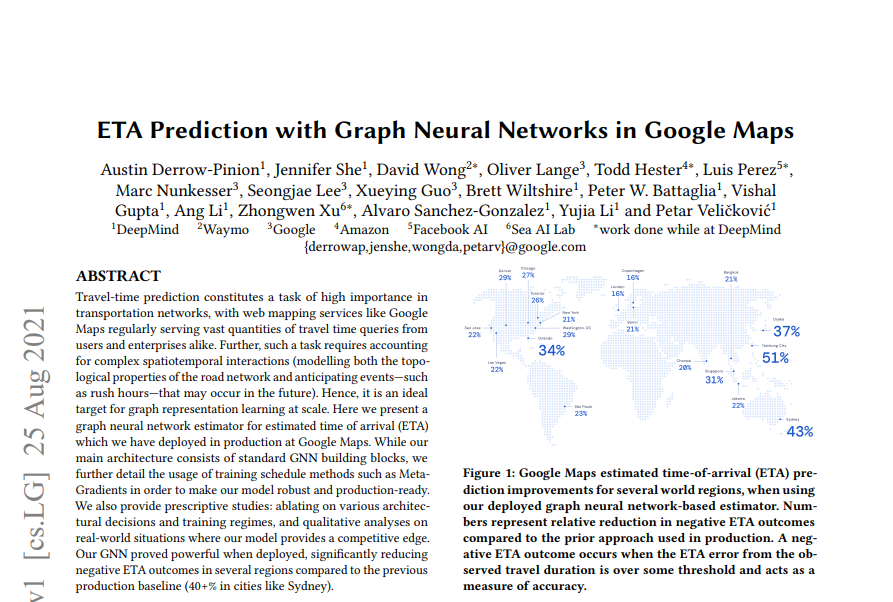
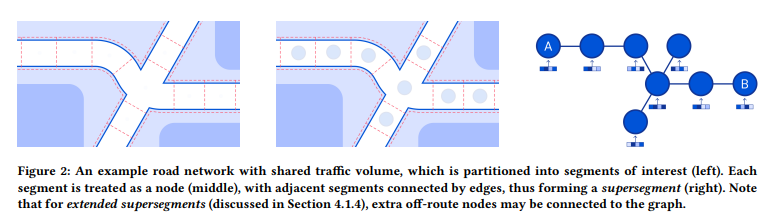
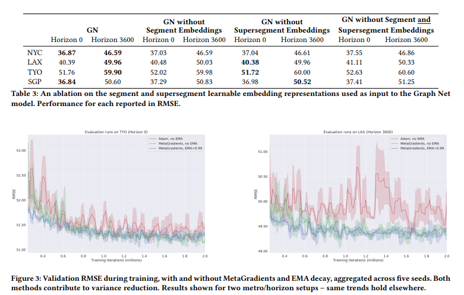
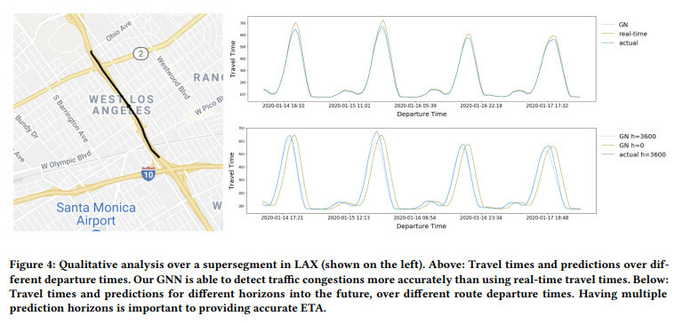

# Paper Review - Day 04

## **Paper Title**: ETA Prediction with Graph Neural Networks in Google Maps
- **Authors**: Austin Derrow-Pinion, Jennifer She, David Wong, Oliver Lange, Todd Hester, Luis Perez, Marc Nunkesser, Seongjae Lee, Xueying Guo, Brett Wiltshire, Peter W. Battaglia, Vishal Gupta, Ang Li, Zhongwen Xu, Alvaro Sanchez-Gonzalez, Yujia Li, Petar Veličković
- **Publication**: CIKM 2021
- **arXiv**: https://arxiv.org/abs/2108.11482

---

---

## 🧾 Summary: 
This paper explores how Google uses GNN technology to accurately predict travel time, when we try to find routes in Google Maps. The model uses a GNN based encoder, processing unit, and decoder with several supportive modules like MetaGradients and tuned combinations of aggregators while training; Exponential Moving Average of params while predicting. It accounts for complex spatiotemporal interactions and significantly reduces negative ETA outcomes. 

## 🚀How?
- It models road networks using supersegments and predicts travel time for each supersegment at different fixed time horizons into the future, which are queried sequentially to arrive at a travel time for the next supersegment, taking into account both spatial and temporal information. 

- Each super segment has some segments, each segment has 50–100 meters of road, where the center of the segment is considered a node, Travel between the nodes are the edges.

# 📂 Data
- A huge amount of data is used to train and infer the model. 
- It uses real-time and historical data on traffic patterns, including segment-level information such as travel speeds and times, segment length, and priority, as well as supersegment-level data such as real-time travel times. 

## ⚙️ Prediction Process
- The model predicts supersegment, segment, and cumulative segment travel times, with the supersegment-level output being used in production. 
- The update functions are MLPs and the aggregation functions are summations, using multiple aggregator functions. 
- It also incorporates learnable embedding vectors for segments and supersegments to enable information sharing across different routes. 
- It used multiple loss functions - each for one type of prediction. 
- They also used extended supersegments in GNN models to improve performance by including nodes from neighboring segments, allowing for additional spatial context, at the expense of data storage, slower training, and inference - which resulted in better performance showing there is actually some relations available.

## 📊 Findings
- The model significantly reduces negative ETA outcomes in several regions compared to the previous production baseline (40+% in cities like Sydney).

- Having multiple prediction horizons improves the accuracy of ETA by comparing predicted travel times over different time frames. The GNN's predictions for a 3600-second horizon match actual travel times better after 60 minutes compared to predictions with a 0-second horizon.

