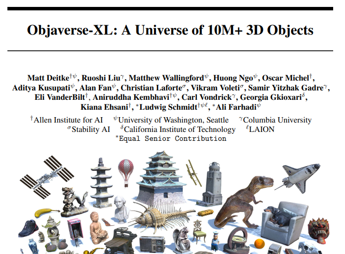
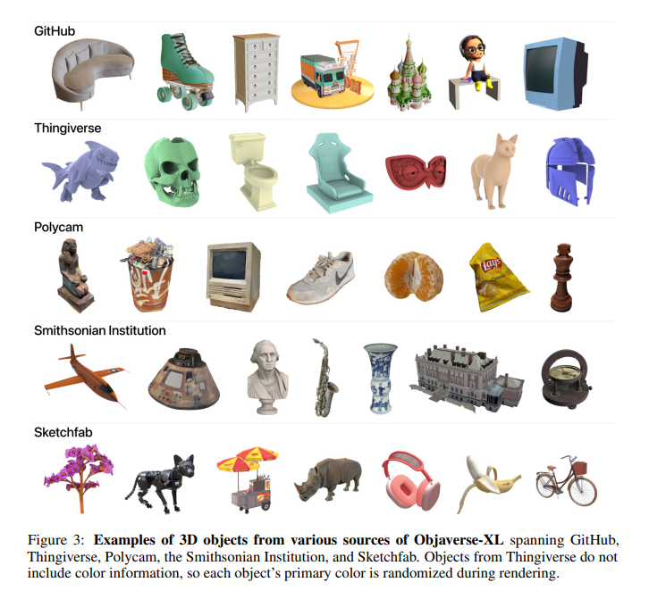
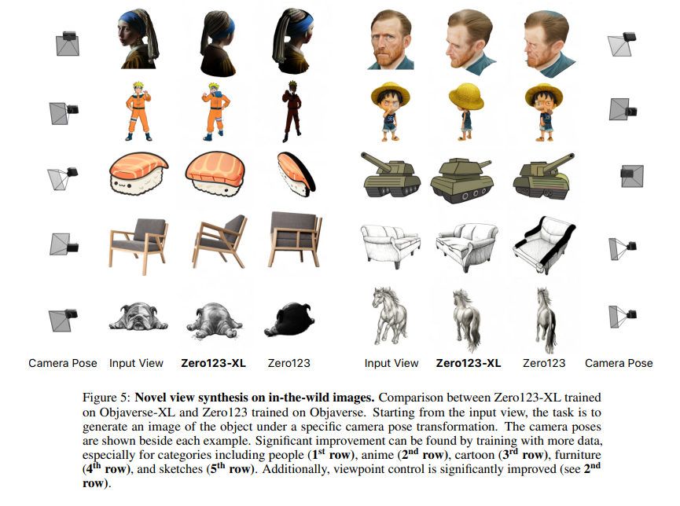
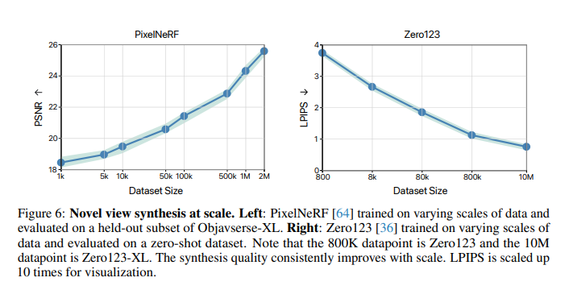

# Paper Review - Day 07

## **Paper Title**: Objaverse-XL: A Universe of 10M+ 3D Objects
- **Authors**: Matt Deitke , Ruoshi Liu, Matthew Wallingford , Huong Ngo , Oscar Michel, Aditya Kusupati, Alan Fan , Christian Laforte, Vikram Voleti, Samir Yitzhak Gadre, Eli VanderBilt, Aniruddha Kembhavi, Carl Vondrick, Georgia Gkioxari, Kiana Ehsani, Ludwig Schmidt, Ali Farhadi
- **arXiv**: http://export.arxiv.org/abs/2307.05663
- **Website (Stability.ai)** : https://stability-ai.squarespace.com/research/objaverse-xl-a-colossal-universe-of-3d-objects

---

---

## 🧾 Summary: 
Objaverse-XL is a dataset of over 10 million diverse 3D objects, including manually designed objects, photogrammetry scans, and professional scans. It provides significant potential for advancements in 3D vision tasks, as demonstrated by improved zero-shot generalization abilities achieved through training with the dataset.

## 🖼️ Dataset Composition
- It consists of over 10 million 3D objects gathered from various sources, including GitHub, Thingiverse, Sketchfab, Polycam, and the Smithsonian Institution. The dataset aims to address the challenge of acquiring high-quality 3D data and provides significant potential for advancements in the field of 3D vision tasks.

- It includes metadata from various sources, such as popularity, license, and textual description. Blender metadata provides additional details like polygon count, vertex count, and animation information. CLIP ViT-L/14 image embeddings are extracted for each object and used for predicting aesthetic scores, NSFW predictions, face detection, and hole detection in photogrammetry renderings.

- Objaverse-XL underwent NSFW filtering, with only 815 out of 10 million objects marked as NSFW based on strict criteria. Face detection analysis revealed that approximately 266,000 objects in the dataset contain detected faces, mostly from sculptures and animations. Photogrammetry hole detection identified that 38.20% of the Polycam objects had "bad" renders with missing information or noise.

## 📊 Findings
- Novel View Synthesis with Zero123-XL
  - Zero123-XL is a novel view synthesis model trained on the larger Objaverse-XL dataset, aiming to generate 3D assets conditioned on real-world 2D images. 
  - The model builds upon the success of pretraining approaches and demonstrates improved performance in zero-shot abilities for generating high-quality novel views of objects.  
  - It also enhances zero-shot generalization for generating consistent and detailed novel views, even for challenging categories like people, cartoons, paintings, and sketches.
- Novel View Synthesis with PixelNeRF
  - PixelNeRF, trained on over two million objects from Objaverse-XL, demonstrates improved performance in synthesizing novel views of scenes and objects compared to previous methods. 
  - The model's generalization ability increases consistently with data scale, and pretraining on Objaverse-XL also enhances performance when fine-tuning on other datasets.

# 👎 Limitations
Objaverse-XL is significantly larger than its predecessor, but still much smaller compared to billion-scale image-text datasets. 