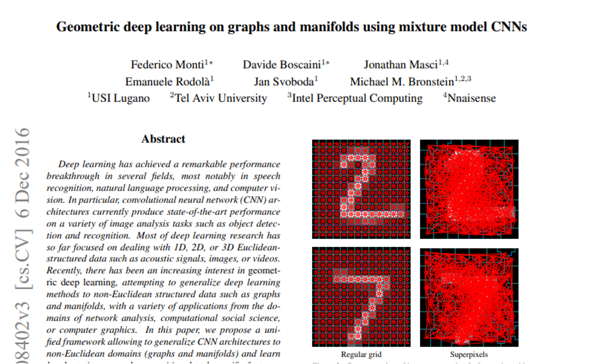
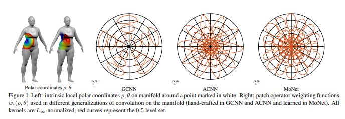
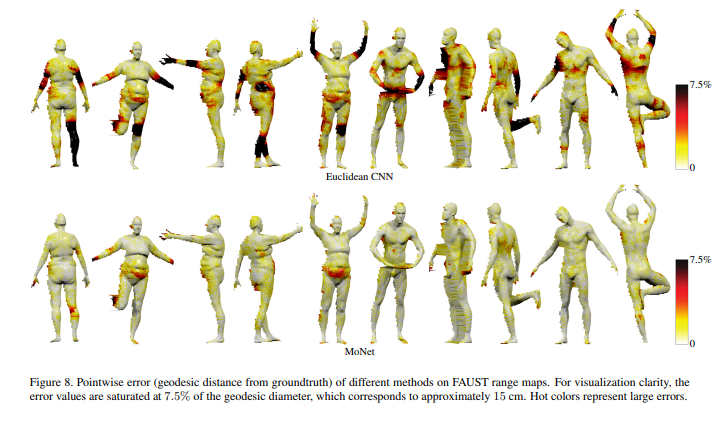
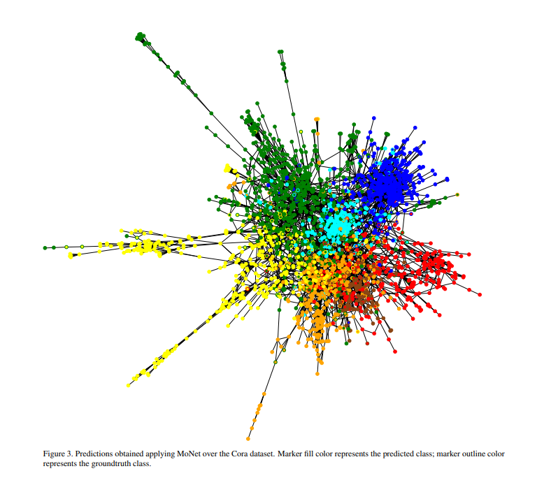
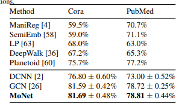

# Paper Review - Day 08 #2

## **Paper Title**: Geometric deep learning on graphs and manifolds using mixture model CNNs
- **Authors**: Federico Monti, Davide Boscaini, Jonathan Masci, Emanuele Rodolà, Jan Svoboda, Michael M. Bronstein
- **Publication**: CVPR
- **arXiv**: https://arxiv.org/abs/1611.08402
- **Code (Papers with Code)** - https://paperswithcode.com/paper/geometric-deep-learning-on-graphs-and
---

---

## 🧾 Summary: 
In this paper, the authors propose a unified framework called mixture model networks (MoNet) to generalize convolutional neural network (CNN) architectures to non-Euclidean domains, such as graphs and manifolds. They demonstrate that various existing non-Euclidean CNN methods can be considered as instances of their framework. The proposed approach, based on template matching with local intrinsic 'patches,' consistently outperforms previous methods on standard tasks in image analysis, graph analysis, and 3D shape analysis. The results highlight the effectiveness of MoNet in leveraging deep learning techniques for non-Euclidean structured data.

## ⚙️ Architecture
It consists of local feature extraction, stationary feature learning, compositional feature learning, and task-specific feature learning. It utilizes a mixture model CNN, polynomial filter bank, pooling operator, and fully connected layers to extract and learn features specific to the given task.

The proposed framework, MoNet, is a spatial-domain approach for deep learning on non-Euclidean domains like graphs and manifolds. It introduces pseudo-coordinates and parametric kernels to construct patch operators for template matching. The resulting convolution-like operations generalize existing methods and outperform them, showcasing the effectiveness and flexibility of the Gaussian mixture model-based approach.

## 📊 Findings 
- Images
  - In the experiment, the proposed MoNet method was compared to classical CNN and spectral graph CNN approaches for handwritten digit classification on the MNIST dataset. While all methods performed similarly on regular grids, when applied to superpixel-based representations, the spectral graph CNN (ChebNet) showed a significant drop in performance (up to 25% decrease), while MoNet consistently achieved high accuracy. The results highlighted the advantage of MoNet in generalizing well to different graph representations, with only a slight degradation observed in coarser presentations.

- Graph
  - MoNet demonstrated favorable vertex classification results on Cora and PubMed citation graphs, outperforming other methods. The use of learned pseudo-coordinates and Gaussian kernels contributed to the success of MoNet. The greater complexity of the MoNet framework proved advantageous, particularly for larger and more complex datasets.
  

- Manifold
  - MoNet outperformed other methods in learning dense intrinsic correspondence between 3D shapes represented as discrete manifolds, achieving superior performance in mesh and range map datasets (FAUST). The correspondence quality was significantly improved, with a high percentage of matches having zero error or an error below 4cm. MoNet's effectiveness was demonstrated in both quantitative evaluation and qualitative visualization.

