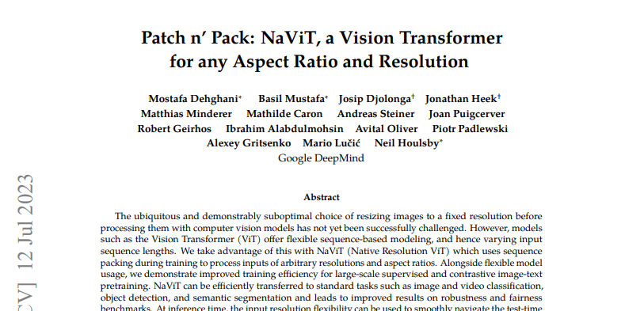
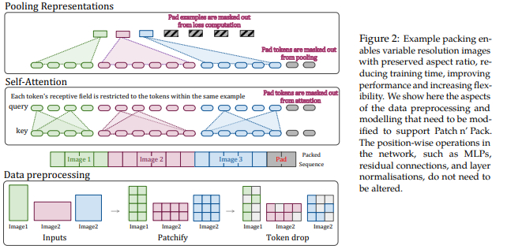
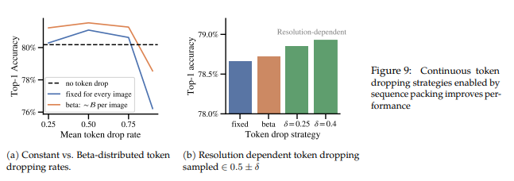
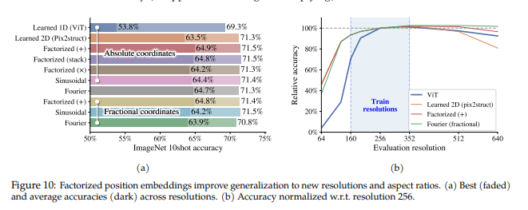
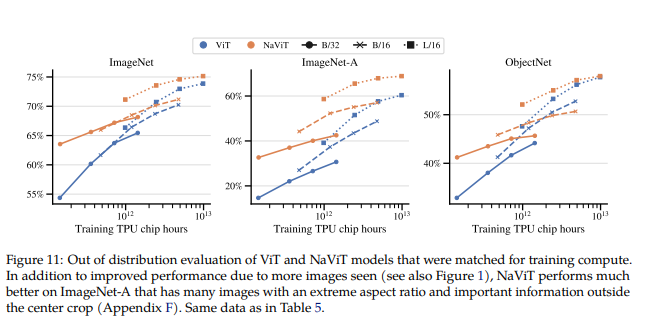

# Paper Review - 12

## **Paper Title**: Patch n’ Pack: NaViT, a Vision Transformer for any Aspect Ratio and Resolution
- **Authors**: Mostafa Dehghani, Basil Mustafa, Josip Djolonga, Jonathan Heek, Matthias Minderer, Mathilde Caron, Andreas Steiner, Joan Puigcerver, Robert Geirhos, Ibrahim Alabdulmohsin, Avital Oliver, Piotr Padlewski, Alexey Gritsenko, Mario Lučić, Neil Houlsby
- **arXiv**: https://arxiv.org/abs/2307.06304
---

---

## 🧾 Summary: 
NaViT (Native Resolution ViT), an alternative approach to image processing using Vision Transformers (ViTs). NaViT utilizes sequence packing during training, allowing it to handle inputs of arbitrary resolutions and aspect ratios. The study demonstrates that NaViT offers improved training efficiency for large-scale supervised and contrastive image-text pretraining. It also shows that NaViT outperforms ViT in terms of performance while utilizing fewer computational resources. The flexible input resolution of NaViT enables smooth trade-offs between cost and performance at inference time. Overall, NaViT presents a promising direction for computer vision models by breaking away from traditional CNN-designed pipelines and offering new possibilities for innovation and advancement.

## ⚙️ Architecture
It leverages the concept of example packing from language modeling to train Vision Transformers (ViTs) on images at their original resolution. By treating images as sequences of patches, it overcomes the limitations of fixed image sizes in computer vision applications, offering improved performance and efficiency compared to resizing or padding methods.

The architectural changes in NaViT include the introduction of masked self-attention and masked pooling to prevent examples from attending to each other, enabling individual token representations per example. Factorized and fractional positional embeddings are used to handle arbitrary resolutions and aspect ratios, allowing for variable aspect ratios and extrapolation to unseen resolutions. Training changes include continuous token dropping, where the token dropping rate can vary per-image, and resolution sampling, which allows training with the original resolution or resampling while preserving aspect ratio. These changes enhance the flexibility and performance of NaViT compared to traditional ViTs.

## 📊 Findings 
- The efficiency of NaViT, a model designed for image classification tasks, is discussed in relation to the use of Patch n' Pack, which involves packing multiple images into longer sequences. The authors demonstrate that as the hidden dimension of the transformer model scales, the computational cost of attention becomes a smaller proportion of the overall cost, including the MLP computation. This reduction in attention overhead leads to increased efficiency when packing examples. Furthermore, memory-efficient methods can be employed to address the challenge of handling extremely long sequences.
- **Variable token dropping** in NaViT offers several benefits. Firstly, using continuously sampled token dropping rates, such as those obtained from a Beta distribution, consistently improves performance compared to a constant drop rate. Secondly, employing resolution-dependent token dropping rates, where the dropping rates are scaled based on the resolution of the images, further enhances performance. Additionally, scheduled token dropping rates allow for easy variation of the dropping rate during training, enabling better control over the trade-off between the number of images seen and the information used per image, ultimately maximizing final accuracy while maintaining a constant training cost. These strategies provide flexibility and optimization opportunities in training NaViT models.

- **Positional embeddings** are a crucial component in vision transformers (ViTs) that encode spatial information into the input image. In this study, the authors evaluate different designs of positional embeddings and their impact on model performance. They train models with factorized embeddings on a range of resolutions and compare them to a baseline ViT and learned 2D embeddings from Pix2struct. The results show that factorized embeddings outperform both the baseline ViT and learned 2D embeddings, especially at higher resolutions. Additive combination of factorized embeddings yields the best results.

- Itdemonstrates favorable **out-of-distribution generalization** compared to a compute-matched ViT baseline on downstream datasets, including ImageNet and robustness variants like ObjectNet and ImageNet-A. Secondly, NaViT exhibits stable calibration without post-hoc recalibration, as quantified by the expected calibration error. Thirdly, NaViT provides better trade-offs in terms of accuracy and latency compared to ViT, even with relatively few patches. Lastly, NaViT improves the accuracy of annotating fairness-related signals, such as gender and ethnicity, outperforming ViT and showing significance in statistical tests.

-  NaViT's performance is evaluated in various **downstream tasks**. In semantic segmentation on the ADE20k dataset, NaViT-L/16 outperforms ViT-L/16 when fine-tuned at different maximum resolutions while preserving the aspect ratio of the original images. NaViT also demonstrates improvements in object detection using OWL-ViT-L/14 models, achieving significantly better results on both common and unseen LVIS "rare" classes compared to ViT. Additionally, in video classification for Kinetics400, NaViT-L achieves competitive performance with ViViT-L but requires approximately 6 times fewer epochs, benefiting from its training flexibility with resolution diversity.
- NaViT exhibits superior performance in semantic segmentation, object detection, and video classification tasks. It surpasses ViT in semantic segmentation on ADE20k by preserving aspect ratios during fine-tuning, outperforms ViT in object detection (LVIS AP scores), and achieves competitive video classification results with fewer training epochs compared to ViViT. These findings highlight NaViT's effectiveness in handling diverse visual tasks and its ability to leverage flexible training settings.