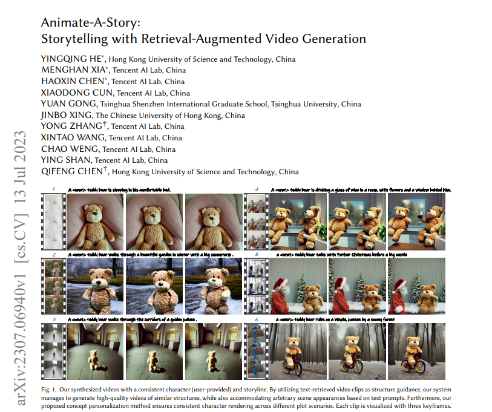
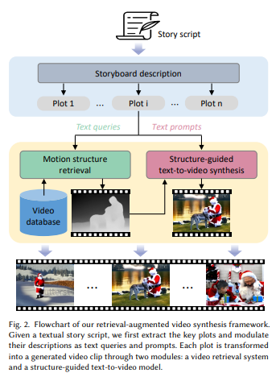
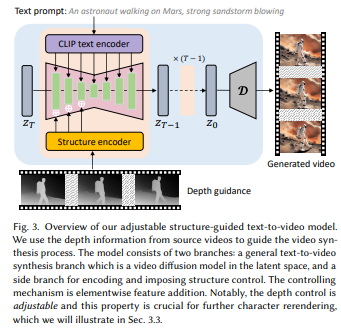
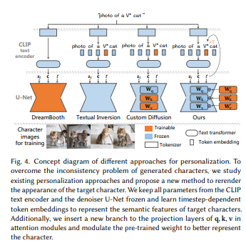
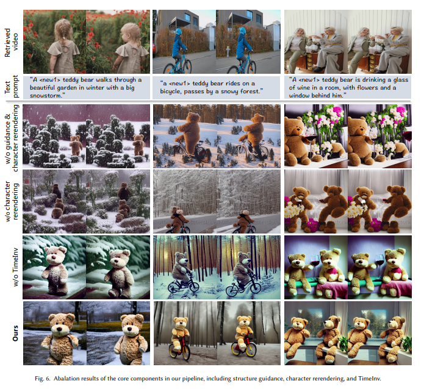

# Paper Review - 13

## **Paper Title**: Animate-A-Story: Storytelling with Retrieval-Augmented Video Generation
- **Authors**: Yingqing He, Menghan Xia, Haoxin Chen, Xiaodong Cun, Yuan Gong, Jinbo Xing, Yong Zhang, Xintao Wang, Chao Weng, Ying Shan, Qifeng Chen
- **arXiv**: https://arxiv.org/abs/2307.06940
- **Code (Github)** - https://github.com/videocrafter/animate-a-story
- Website : https://videocrafter.github.io/Animate-A-Story/
---

---

## 🧾 Summary: 
The key idea of the proposed framework is to generate storytelling videos by customizing the appearances of existing video clips, bypassing the need for live-action filming or graphics animation. The framework consists of two modules: Motion Structure Retrieval, which retrieves video candidates based on desired scene or motion context described by query texts, and Structure-Guided Text-to-Video Synthesis, which generates plot-aligned videos using motion structure and text prompts. The approach offers flexible controls over structure and characters, ensuring visual consistency across clips through concept personalization. Experimental results demonstrate the effectiveness and advantages of the approach over existing baselines.

## ⚙️ Architecture
Here is a breakdown of the key technical designs :
- Retrieving Existing Video Assets: In this step, they propose to retrieve video assets from existing sources. These video assets will serve as resources or references for creating the storytelling videos. The retrieval process may involve searching for relevant videos based on certain criteria or keywords.

- Extracting Structures from Retrieved Videos: Once the video assets are retrieved, it extracts structures from these videos. These structures could include scene compositions, camera angles, transitions, or other elements that contribute to the overall storytelling. These extracted structures will serve as guidance signals for the T2V process.
- Guided T2V Process: The T2V process refers to converting a given storyline script or minimal interactive effort into a video format. By utilizing the extracted structures from the retrieved videos, the T2V process can be guided to produce high-quality storytelling videos. These structures help ensure that the generated videos follow established narrative patterns and visual compositions.

- Video Character Rerendering with TimeInv: They introduce the concept of video character rerendering using the proposed TimeInv approach. This approach aims to synthesize consistent characters across different video clips. It suggests a method to maintain visual consistency and coherence of characters throughout the generated videos, even if they come from different sources.

## 📊 Findings 
- The evaluated text-to-video synthesis models include T2V-Zero with depth control, ModelScope, LVDM, and the proposed model. Performance was measured using FVD and KVD metrics on the UCF-101 dataset. The proposed model achieved the best results, surpassing existing models with depth guidance and outperforming pure text-based video synthesis.
- DreamBooth suffers from overfitting and lacks generation diversity, Textual Inversion exhibits poor character fidelity, Custom Diffusion with Textual Inversion shows artifacts in generated characters, and TimeInv combined with Custom Diffusion achieves better semantic alignment and background diversity. When compared to Textual Inversion, TimeInv demonstrates better character similarity.
