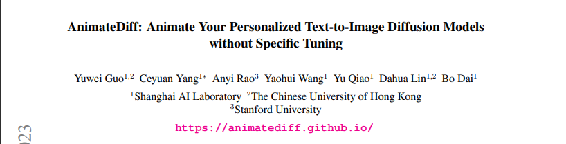
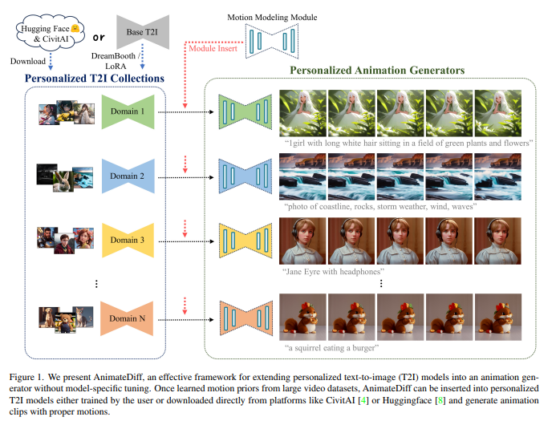
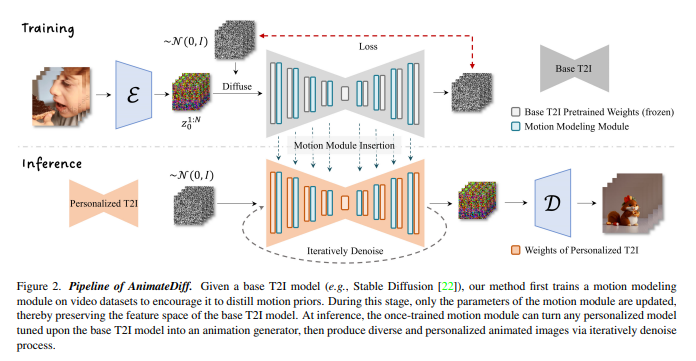

# Paper Review - 14

## **Paper Title**: AnimateDiff: Animate Your Personalized Text-to-Image Diffusion Models without Specific Tuning
- **Authors**: Yuwei Guo, Ceyuan Yang, Anyi Rao, Yaohui Wang, Yu Qiao, Dahua Lin, Bo Dai
- **arXiv**: https://arxiv.org/abs/2307.04725
- **Website** - https://animatediff.github.io/
---

---

The paper proposes a practical framework called AnimateDiff to animate personalized text-to-image (T2I) models without the need for model-specific tuning efforts.

The framework involves inserting a motion modeling module into a base T2I model and training it on video clips to learn reasonable motion priors.
Once trained, the motion modeling module can be injected into personalized versions of the T2I model, enabling them to generate diverse and personalized animated images with smooth animation.

The proposed method is evaluated on several public personalized T2I models for anime pictures and realistic photographs, demonstrating that it produces temporally smooth animation clips while preserving domain and diversity.

Most failure cases occur when the domain of the personalized T2I model is far from realistic, indicating a distribution gap between training videos and the personalized model. Fine-tuning the motion modeling module with target domain videos is suggested as a possible solution.

AnimateDiff provides a simple yet effective baseline for personalized animation, allowing users to quickly obtain personalized animations by leveraging the motion modeling module trained on a base T2I model.

