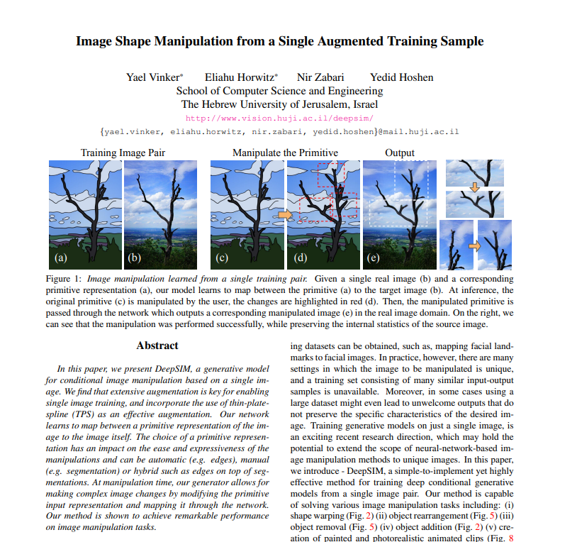
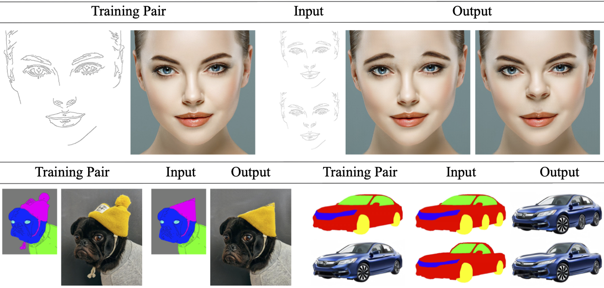
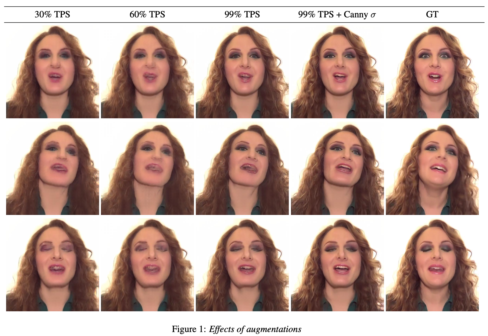
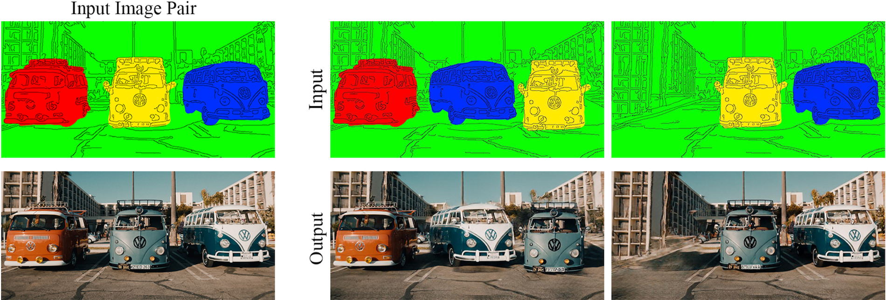

# Paper Review - 15

## **Paper Title**: DeepSIM: Image Shape Manipulation from a Single Augmented Training Sample
- **Authors**: Yael Vinker, Eliahu Horwitz, Nir Zabari, Yedid Hoshen
- **arXiv**: https://arxiv.org/abs/2007.01289
- **Code (Github)** - https://github.com/eliahuhorwitz/DeepSIM
- Publication : ICCV 2021 (Oral)

---

---

## 🧾 Summary: 
The paper introduces DeepSIM, a generative model for conditional image manipulation based on a single image. The key to enabling single image training is the extensive use of augmentation techniques, particularly the incorporation of thin-plate-spline (TPS) as an effective augmentation method. DeepSIM learns to map between a primitive representation of the image and the image itself, which allows for complex image changes by modifying the primitive input and mapping it through the network. The authors demonstrate that DeepSIM achieves remarkable performance on various image manipulation tasks, thanks to its ability to modify specific image details such as shape or location while preserving semantic and geometric attributes. The paper also highlights the importance of TPS augmentation in training conditional generative models based on a single image-pair, surpassing the standard crop-and-flip augmentation used in the image translation community.

## ⚙️ Architecture
The method proposed in the paper is called DeepSIM, which involves learning a conditional generative adversarial network (cGAN) using a single image pair consisting of the main image and its primitive representation. To overcome the limited training data, data augmentation techniques such as thin-plate-spline warps are applied to the training pair. The objective of the method is to train the generator to produce output images that reflect the primitive representation and appear to come from the same distribution as the training image. The model design follows standard cGAN practices, and the fidelity of the generated images is measured using VGG perceptual loss. The augmentation process involves applying random TPS warps to both the input primitive and the image. The generator and discriminator are then optimized adversarially to minimize the total loss. The image primitive used in this work is a combination of edge representation and semantic instance/segmentation map, aiming to provide both high-level properties and fine-details guidance for image editing.

## 📊 Findings 
- The authors propose a video-based benchmark for evaluating conditional single image generation methods, using LPIPS and SIFID metrics to measure prediction error and fidelity. Their method, DeepSIM, outperforms Pix2PixHD-SIA in terms of fidelity and quality, demonstrating the importance of TPS augmentation for single image conditional generation.

- It has a faster training time compared to alternative methods like SinGAN and TuiGAN, which require new training processes for each manipulation. The cGAN loss is found to be necessary for better perceptual results, especially for high-resolution images. However, methods trained on large datasets may not generalize well to rare images outside their training distribution. DeepSIM also exhibits failure modes including incorrect generation of unseen objects, background duplication, and interpolation 
errors in empty image regions.

