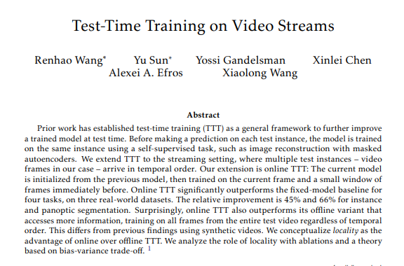
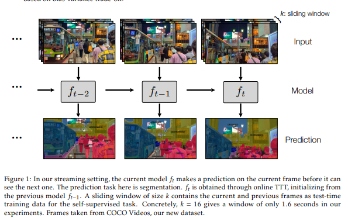
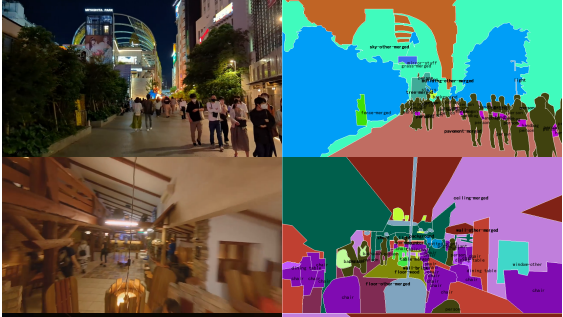
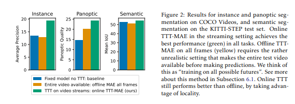

# Paper Review - 16

## **Paper Title**: Test-Time Training on Video Streams
- **Authors**: Renhao Wang, Yu Sun, Yossi Gandelsman, Xinlei Chen, Alexei A. Efros, Xiaolong Wang
- **arXiv**: https://arxiv.org/abs/2307.05014
- **Websute** - https://video-ttt.github.io/
---

---

## 🧾 Summary: 
The authors propose an extension to the test-time training (TTT) framework called online TTT, specifically designed for the streaming setting where sequential video frames are processed. The current model is initialized from the previous model and trained on the current frame along with a small window of preceding frames. Online TTT outperforms fixed-model baselines and even its offline variant, which uses all frames from the entire test video, showcasing the advantage of temporal locality in improving performance. The researchers analyze this advantage through ablations and a bias-variance trade-off theory.

## ⚙️ Architecture
It involves training a model with joint optimization of self-supervised and main tasks, using both labeled images and unlabeled videos during training. At test time, the model is applied to each frame of a video stream, making predictions based on the current frame and past frames. The algorithm incorporates both implicit memory, by not resetting model parameters between timesteps, and explicit memory, by retaining recent frames in a sliding window. This approach aims to leverage temporal smoothness and relevant information from past frames to improve predictions over time.

## 📊 Discussions

The method discussed in the given text involves unsupervised domain adaptation (UDA) and test-time adaptation, where each test video is treated as a target domain. The authors argue that this perspective may be misleading as it discourages locality. Furthermore, the text explores the concept of forgetting in continual learning, suggesting that it can actually be beneficial. Lastly, the authors propose a heuristic called Test-time training on nearest neighbors (TTT-NN), which involves retrieving nearest neighbors from either past unlabeled test instances or labeled training data for fine-tuning the model. They highlight the advantage of their method, as the retrieved neighbors from test instances are always relevant due to temporal smoothness, unlike those from the training set.

## 📊 Findings 

