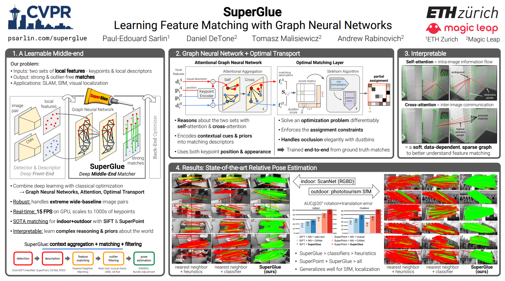
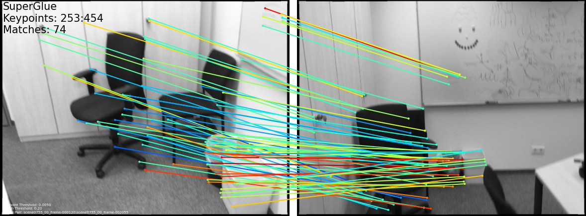
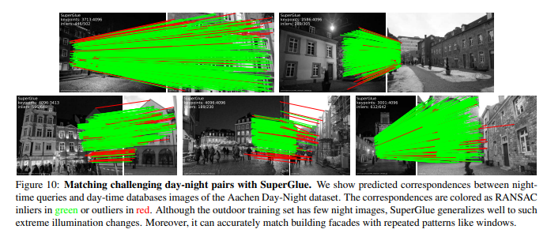

# Paper Review - 17

## **Paper Title**: SuperGlue: Learning Feature Matching with Graph Neural Networks
- **Authors**: Paul-Edouard Sarlin, Daniel DeTone, Tomasz Malisiewicz, Andrew Rabinovich
- **arXiv**: https://arxiv.org/abs/1911.11763
- **Website** - https://psarlin.com/superglue/
- **GitHub** - https://github.com/magicleap/SuperGluePretrainedNetwork
- Slides - https://psarlin.com/superglue/doc/superglue_slides.pdf
-  CVPR 2020

---

---

## 🧾 Summary: 
The SuperGlue method introduces a neural network approach for matching local features in image pairs. It jointly solves the problem of finding correspondences and rejecting non-matchable points by applying a differentiable optimal transport framework. The method utilizes a graph neural network to predict costs for the optimal transport problem, incorporating attention mechanisms for flexible context aggregation. Through end-to-end training, SuperGlue learns priors over geometric transformations and 3D scene regularities, outperforming traditional heuristics and achieving state-of-the-art results in pose estimation for challenging real-world environments. The method is efficient and can be readily integrated into SfM (Structure from Motion) or SLAM (Simultaneous Localization and Mapping) systems.

## ⚙️ Architecture
The SuperGlue architecture is a deep neural network-based model for feature matching in image pairs. It aims to find correspondences between reprojections of the same 3D points and identify keypoints that have no matches. The model formulates the matching problem as an optimization task, where the cost function is predicted by the neural network. It incorporates contextual cues and spatial relationships between keypoints using an Attentional Graph Neural Network. The keypoint encoder combines visual appearance and position information, while the multiplex graph connects keypoints within and across images. The optimal matching layer produces a partial assignment matrix, which is used to compute the final matches. The model is trained in a supervised manner using ground truth matches and can handle unmatched keypoints.

## 🛑 Key points
1. Attention-Based Graph Neural Networks: The paper highlights the power of attention-based graph neural networks in local feature matching. SuperGlue's architecture incorporates self-attention and cross-attention mechanisms, enhancing the receptive field of local descriptors and enabling effective communication between images. This approach draws inspiration from how humans visually match images by looking back-and-forth.

2. Optimal Transport for Handling Partial Assignments and Occluded Points: SuperGlue tackles challenges such as partial assignments and occluded points by formulating them as an optimal transport problem. By leveraging this methodology, SuperGlue can handle these issues more effectively compared to existing approaches. This capability contributes to achieving highly accurate relative pose estimation on wide-baseline indoor and outdoor image pairs.

3. Unified Architecture for Context Aggregation, Matching, and Filtering: SuperGlue introduces a learnable middle-end that replaces handcrafted heuristics with a powerful neural model capable of performing context aggregation, matching, and filtering simultaneously. This unified architecture streamlines the entire process and eliminates the need for separate components for different tasks. When combined with a deep front-end, SuperGlue represents a significant advancement towards end-to-end deep SLAM (Simultaneous Localization and Mapping).

## 📊 Findings 
1. Homography Estimation: The SuperGlue algorithm performs exceptionally well in homography estimation experiments, significantly outperforming other methods such as RANSAC and DLT. It achieves a high Area Under the Curve (AUC) score and demonstrates superior precision and recall rates.

2. Indoor Pose Estimation: SuperGlue proves to be effective in indoor image matching tasks, which are challenging due to factors like texture scarcity, self-similarities, complex 3D geometry, and viewpoint changes. Compared to both handcrafted and learned matchers, SuperGlue achieves higher pose accuracy and precision. It generates a larger number of correct matches and outperforms other learned matchers in terms of representation power.

3. Outdoor Pose Estimation: When applied to outdoor pose estimation, SuperGlue surpasses all baseline methods, including both SuperPoint and SIFT. It achieves high precision in matching and performs well across various relative pose thresholds. The results indicate that SuperGlue excels at "gluing" together local features in outdoor image sequences despite challenges like lighting changes and occlusion.

SuperGlue's advanced feature matching capabilities can enable NERF (Neural-network-based Efficient Robust Feature Matching and Pose Estimation) systems to achieve state-of-the-art results, improving the accuracy and reliability of 3D scene reconstruction and localization.
