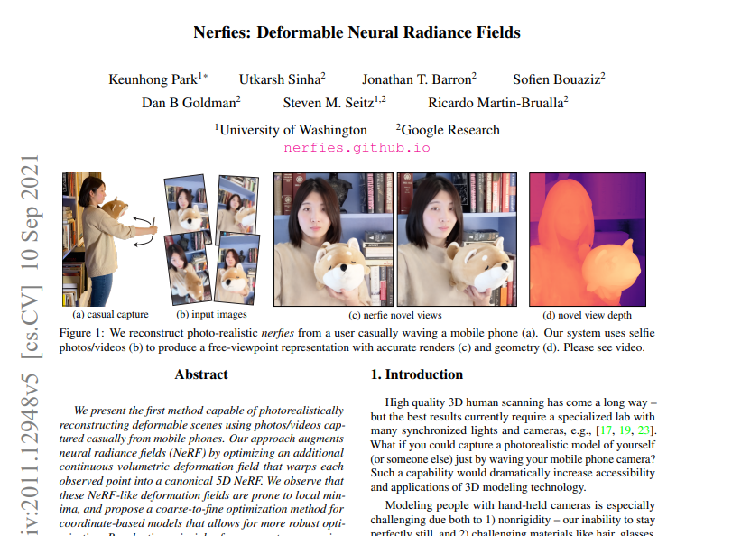
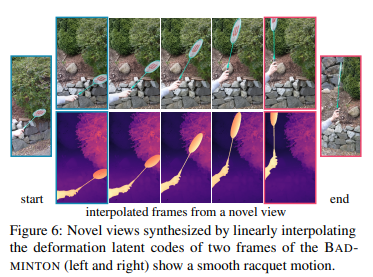
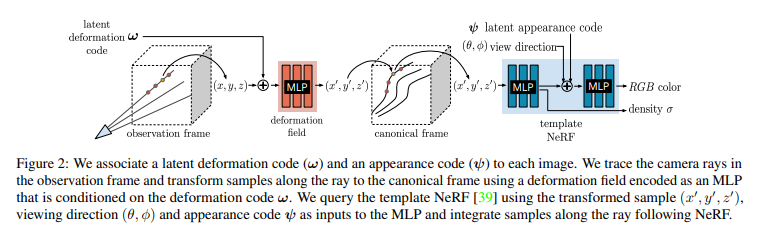
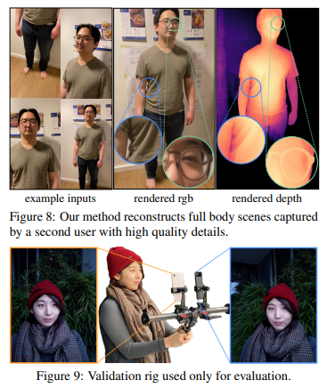
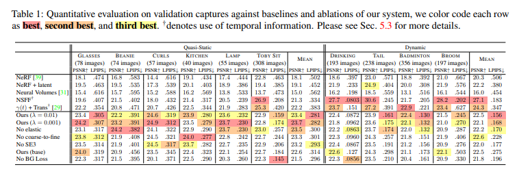

# Paper Review - 18

## **Paper Title**: Nerfies: Deformable Neural Radiance Fields
- **Authors**: Keunhong Park, Utkarsh Sinha, Jonathan T. Barron, Sofien Bouaziz, Dan B Goldman, Steven M. Seitz, Ricardo Martin-Brualla
- **arXiv**: https://arxiv.org/abs/2011.12948
- **Website** - https://nerfies.github.io/
- **GitHub** - https://github.com/google/nerfies
- Data - https://github.com/google/nerfies/releases/tag/0.1

---

---

## 🧾 Summary: 
The presented method introduces a novel approach for photorealistically reconstructing deformable scenes using photos/videos captured from mobile phones. It extends the Neural Radiance Fields (NeRF) framework by optimizing a continuous volumetric deformation field that warps each observed point into a canonical 5D NeRF. To address optimization challenges, a coarse-to-fine scheme is proposed, gradually introducing higher frequencies into the deformation field network. Additionally, an elastic regularization technique is employed to enhance robustness. The method, termed "nerfies", enables the generation of deformable NeRF models from casually captured selfie photos/videos, allowing for realistic renderings from arbitrary viewpoints. Evaluation involves capturing synchronized image sequences and predicting views from one camera using reconstruction from the other. Their contributions also include handling non-rigid deformations in NeRF, rigidity priors for neural network-defined deformation fields, and the reconstruction of free-viewpoint selfies.

## ⚙️ Architecture
The Deformable Neural Radiance Fields (NeRF) method is designed to model non-rigidly deforming scenes using casually captured images. It combines a template volume represented as a NeRF with a per-observation deformation field to represent moving subjects. The optimization problem is addressed through elastic regularization on the deformation, background regularization to prevent unwanted movements, and a continuous coarse-to-fine annealing technique to avoid local minima. The method extends the NeRF framework by introducing a continuous function-based representation of the deformation field using a Multi-Layer Perceptron (MLP). Overall, Deformable NeRF allows for the reconstruction and tracking of non-rigid scenes and objects by incorporating deformations into the NeRF model.

## 📊 Discussions
The procedure for creating "nerfies" involves capturing a sequence of selfie photos or a selfie video where the user waves the camera around their face, covering viewpoints within a 45-degree cone. The system then uses camera registration techniques to align the cameras with respect to a static background and applies foreground segmentation to remove features on the moving subject, ensuring accurate reconstruction of the background.

## 📊 Findings 
- In the quantitative evaluation, they compare their approach against baseline methods such as NeRF, NeRF + latent, D-NeRF, Neural Volumes (NV), and Neural Scene Flow Fields (NSFF). They use metrics like LPIPS and PSNR to assess the visual quality of the reconstructed views and find that their method outperforms the baselines in terms of LPIPS for all sequences. They also conduct an ablation study to evaluate the contributions of different components in their approach, showing that elastic regularization, background regularization, and coarse-to-fine optimization significantly improve results.
- In the qualitative evaluation, they showcase the fine details captured by their method, including hair strands, clothing wrinkles, and glasses. They demonstrate that their method can reconstruct general scenes beyond human subjects and create smooth animations through latent code interpolation. They also highlight the benefits of elastic regularization in addressing under-constrained cases and present depth visualizations to assess reconstruction quality. 

