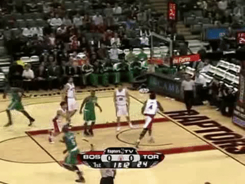

# Paper Review - 19

## **Paper Title**: Tracking Anything in High Quality
- **Authors**: Jiawen Zhu, Zhenyu Chen, Zeqi Hao, Shijie Chang, Lu Zhang, Dong Wang, Huchuan Lu, Bin Luo, Jun-Yan He, Jin-Peng Lan, Hanyuan Chen, Chenyang Li
- **arXiv**: https://arxiv.org/abs/2307.13974
- **GitHub** - https://github.com/jiawen-zhu/HQTrack

---

Tracking Anything in High Quality (HQTrack) is a framework for high performance video object tracking and segmentation. It mainly consists of a Video Multi-Object Segmenter (VMOS) and a Mask Refiner (MR), can track multiple target objects at the same time and output accurate object masks.

---

## 🧾 Summary: 
The proposed method, HQTrack, aims to achieve high-quality object tracking in videos. It consists of two main components: a video multi-object segmenter (VMOS) and a mask refiner (MR). VMOS propagates object masks from the initial frame to the current frame using a gated propagation module and an enhanced feature extractor. However, VMOS's accuracy is limited in complex scenes, so a pre-trained HQ-SAM model is employed as MR to refine the tracking masks. The refined masks are obtained by feeding the outer enclosing boxes from VMOS into HQ-SAM along with the original images. Without employing additional techniques, HQTrack achieved second place in the Visual Object Tracking and Segmentation challenge.

## ⚙️ Architecture
- The proposed HQTrack method is a video object segmentation framework that consists of two main components: the Video Multi-object Segmenter (VMOS) and the Mask Refiner (MR). 
- In the VMOS component, the video frames are segmented using a variant of the DeAOT model. VMOS employs a hierarchical propagation process to associate multiple objects in a unified embedding space. To improve segmentation performance, VMOS utilizes a cascaded GPM module with multiple scales for propagating visual and identification features.
- The MR component utilizes a pre-trained HQ-SAM model, a variant of SAM, to refine the segmentation masks generated by VMOS. HQ-SAM introduces additional parameters to improve performance on objects with intricate structures. The predicted mask from VMOS is used as input, and box prompts extracted from the predicted masks are fed into HQ-SAM to obtain refined masks.
- Finally, the output mask of HQTrack is selected based on an IoU threshold between the masks from VMOS and HQ-SAM. If the IoU score is higher than the threshold, the refined mask from HQ-SAM is chosen as the final output. This approach ensures that HQ-SAM focuses on refining the current object mask rather than re-predicting another target object.

## 📊 Findings 
The experimental results show that joint tracking, where all target objects are tracked with a single tracker, outperforms separate tracking using multiple trackers for each object. This indicates that joint tracking improves robustness to distractor interference by better understanding the relationship between target objects. Component-wise analysis reveals that incorporating multi-scale propagation and using InternImage-T backbone significantly improve performance. Ablation study on the long-term memory gap parameter suggests a value of 50 yields the best performance. Additionally, refining segmentation masks using SAM improves results but may harm performance for low-quality masks, therefore a combination of masks from VMOS and SAM based on IoU score is proposed.

