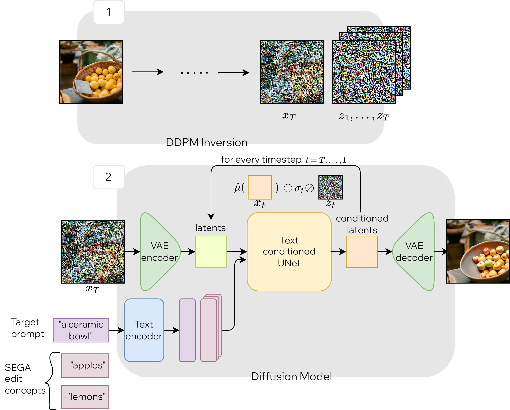

# Paper Review - 20

## **Paper Title**: LEDITS: Real Image Editing with DDPM Inversion and Semantic Guidance
- **Authors**: Jiawen Zhu, Zhenyu Chen, Zeqi Hao, Shijie Chang, Lu Zhang, Dong Wang, Huchuan Lu, Bin Luo, Jun-Yan He, Jin-Peng Lan, Hanyuan Chen, Chenyang Li
- **arXiv**: https://arxiv.org/abs/2307.00522
- **Try It** - https://huggingface.co/spaces/editing-images/ledits
- **HF Demo** - https://huggingface.co/spaces/editing-images/edit_friendly_ddpm_x_sega
- **Colab** - [Click Here](https://colab.research.google.com/#fileId=https%3A//huggingface.co/spaces/editing-images/ledits/blob/main/LEDITS_ddpm_inversion_x_sega.ipynb)
---

---

## 🧾 Summary: 
LEDITS is a combined lightweight method for real-image editing that incorporates the Edit Friendly DDPM inversion technique with Semantic Guidance. It extends the Semantic Guidance technique to real image editing and harnesses the editing capabilities of the DDPM inversion as well. LEDITS allows for versatile edits, including subtle and extensive alterations in composition and style, without requiring optimization or extensions to the architecture. The method achieves competitive qualitative results compared to state-of-the-art methods and provides code examples on the project's webpage.

## ⚙️ Architecture
The proposed architecture LEDITS (Latent Editing with DDPM Inversion and SEGA), is a modification to the SEGA (Semantic Editing GAN for Images) scheme for diffusion denoising. It integrates the DDPM (Diffusion Models) inversion method with SEGA to provide greater flexibility and control over image editing. The architecture involves estimating the latent code of an input image using DDPM inversion and then performing a denoising loop with the DDPM inversion scheme and pre-computed noise vectors. The latents are updated based on a diffusion model's noise estimate with semantic guidance. LEDITS allows for fine-grained control over edit operations by simultaneously using both DDPM inversion and SEGA methods. The architecture's functionality is demonstrated in Fig. 3, showing images edited purely with DDPM inversion and images edited with LEDITS using both methods together.

## 📊 Findings 
The experimental results demonstrate that the combined approach of using SEGA guidance vectors with DDPM inversion enhances diversity, versatility, and control over edit operations. The qualitative experiments show competitive results compared to state-of-the-art methods, offering a balance between fidelity and creativity in image editing. The integration of both approaches compensates for their respective limitations and maintains the performance advantages of each technique, making the overall approach lightweight and effective.
