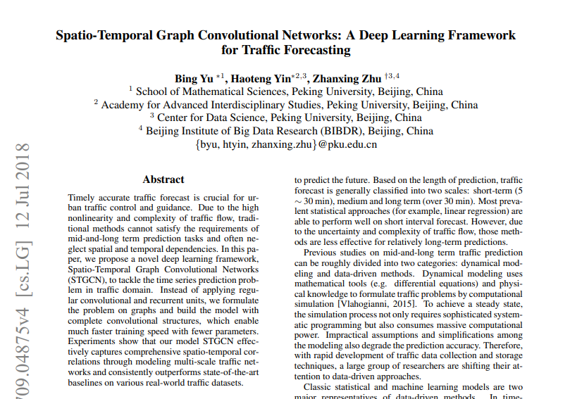
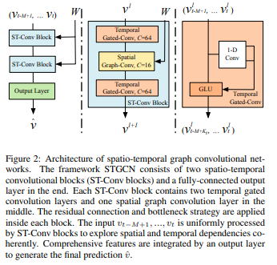
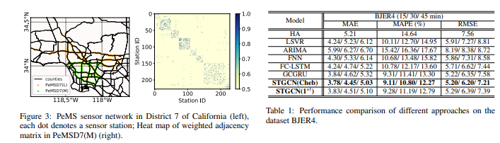
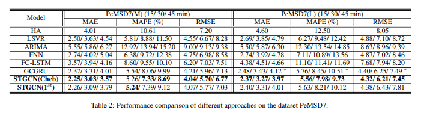

# Paper Review - 21

## **Paper Title**: Spatio-Temporal Graph Convolutional Networks: A Deep Learning Framework for Traffic Forecasting
- **Authors**: Bing Yu, Haoteng Yin, Zhanxing Zhu
- **arXiv**: https://arxiv.org/abs/1709.04875
- **Code (PaperwithCode)** - https://paperswithcode.com/paper/spatio-temporal-graph-convolutional-networks
- Publication: https://www.ijcai.org/proceedings/2018/0505.pdf
- Publication : IJCAI 2018

---

---

## 🧾 Summary: 
In this paper, the authors propose a novel deep learning framework called Spatio-Temporal Graph Convolutional Networks (STGCN) for traffic prediction. Traditional methods for traffic forecasting often overlook spatial and temporal dependencies, leading to inaccurate predictions. The STGCN model addresses this issue by formulating the problem on graphs and utilizing complete convolutional structures, enabling faster training with fewer parameters. The model effectively captures spatio-temporal correlations by modeling multi-scale traffic networks. Experimental results demonstrate that STGCN outperforms state-of-the-art baselines on real-world traffic datasets, indicating its potential for accurate traffic forecasting and practical applicability in both scholarly and industry contexts.

## ⚙️ Architecture
The proposed architecture, called Spatio-Temporal Graph Convolutional Networks (STGCN), consists of spatio-temporal convolutional blocks that extract spatial and temporal features from structured time series data. The model employs graph convolutions to capture the spatial attributes of traffic networks and uses Chebyshev polynomial approximation and 1st-order approximation to reduce computational complexity. For capturing temporal dynamics, gated linear units (GLU) are used in a convolutional structure on the time axis. The STGCN model combines both spatial and temporal information in a spatio-temporal convolutional block, allowing it to handle large-scale networks efficiently. It is a universal framework applicable not only to traffic network modeling but also to other spatio-temporal sequence learning tasks.

## 📊 Findings 
The experiment results show that the proposed STGCN model outperforms traditional statistical and machine learning methods in both short-term and long-term forecasting on the BJER4 and PeMSD7(M/L) datasets. The inclusion of spatial topology in STGCN leads to more accurate predictions, especially on the complex and structured PeMS sensor network. STGCN also demonstrates better performance in capturing rush hour trends and has faster training time compared to GCGRU models. Overall, STGCN achieves superior results while using fewer parameters than other deep learning models.

