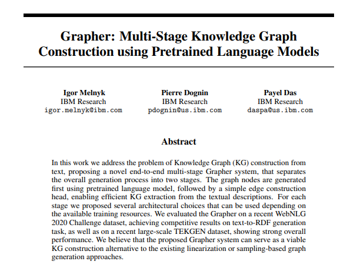
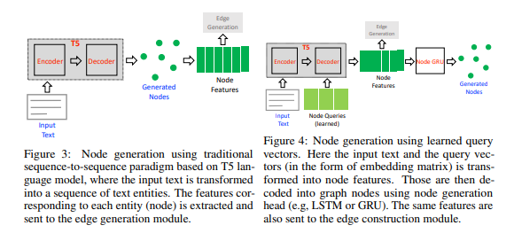
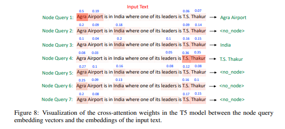

# Paper Review - 22

## **Paper Title**: Knowledge Graph Generation From Text
- **Authors**: Igor Melnyk, Pierre Dognin, Payel Das
- **Paper**: https://openreview.net/forum?id=N2CFXG8-pRd
- **Code (GitHub)** - https://github.com/IBM/Grapher

---

---

## 🧾 Summary: 
The proposed method, called Grapher, addresses the problem of constructing Knowledge Graphs (KGs) from text. It is a multi-stage system that separates the graph generation into two steps. In the first step, nodes are generated from the input text using a pretrained language model. These node features are then used in the second step to generate edges and construct the final graph. The method offers several architectural options for both node and edge generation, depending on available training resources. Experimental evaluations on WebNLG and TEKGEN datasets demonstrate strong overall performance, making Grapher a promising alternative to existing KG construction approaches.

## ⚙️ Architecture
- The proposed system, Grapher, is a novel Knowledge Graph construction system that addresses the shortcomings of existing methods. It consists of two main steps: node generation and edge generation.
- In the node generation step, a pre-trained language model (such as T5) is used to extract entities from the input text and generate a set of unique nodes for the graph. This is done by fine-tuning the language model on the task of entity extraction.
- In the edge generation step, the relationships between the nodes are generated using the available entity information. A prediction head determines the existence of an edge between pairs of node features. The system offers two options for edge generation: generating edges as a sequence of tokens or using a classification head to predict the edges.
- There are three key properties of Grapher. 
  - First, the use of pre-trained language models enhances the algorithm's performance and allows for efficient graph construction. 
  - Second, the system is designed to generate each node and edge only once, improving efficiency compared to other approaches. 
  - Third, Grapher is end-to-end trainable, optimizing both node and edge generation jointly without the need for external NLP pipelines.

## 📊 Findings 
The Grapher system, based on Text Nodes and Class Edges, achieved the second best performance on the WebNLG test set, closely following ReGen. The approach that generates nodes directly as strings using T5-based model outperformed the alternative method of generating nodes through query vectors. On the TEKGEN dataset, the Grapher system based on Text Nodes also outperformed the query-based system, and the GRU-based edge decoding performed similarly or better than the classification edge head, especially on the larger-size TEKGEN dataset.

