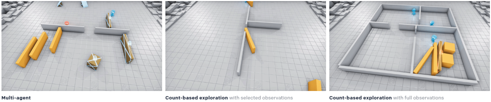
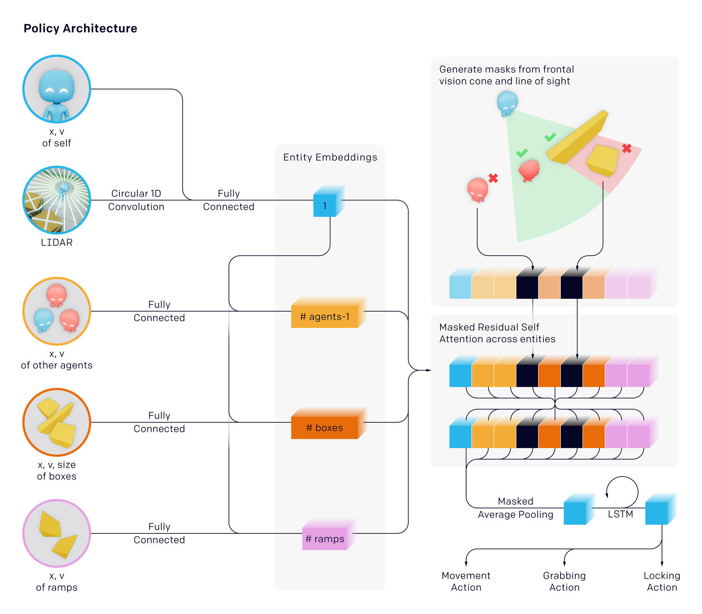
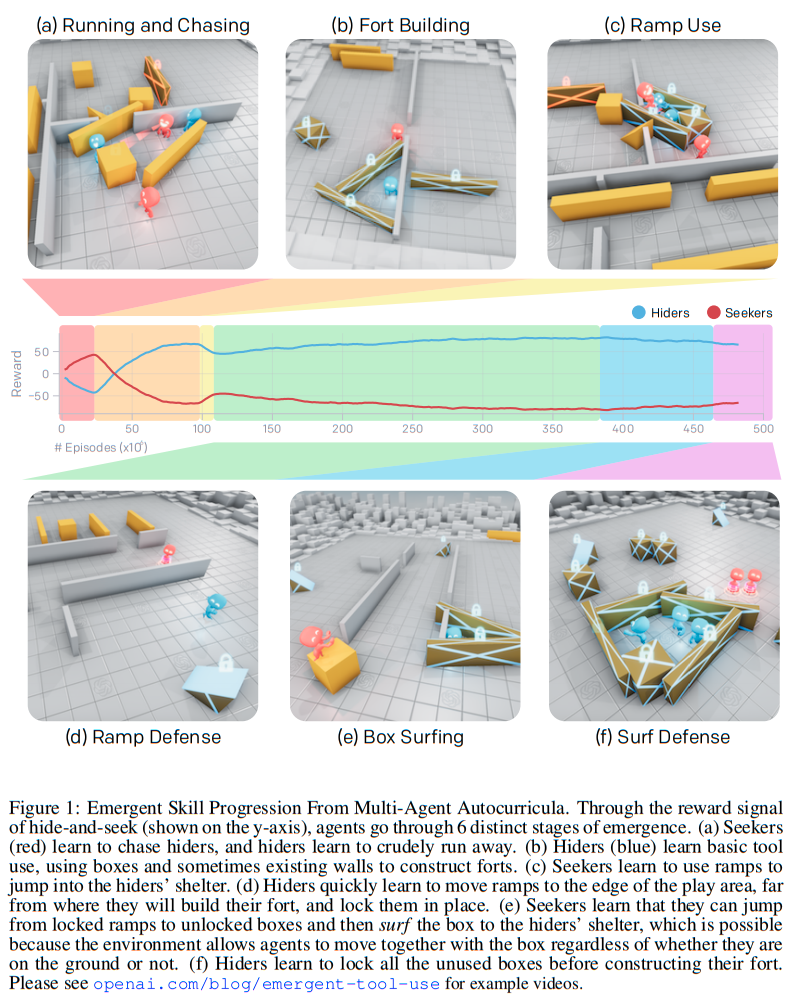

# Paper Review - 23

## **Paper Title**: Emergent Tool Use From Multi-Agent Autocurricula
- **Authors**: Bowen Baker, Ingmar Kanitscheider, Todor Markov, Yi Wu, Glenn Powell, Bob McGrew, Igor Mordatch
- **Explanation Video** - https://www.youtube.com/watch?v=kopoLzvh5jY
- **Paper**: https://arxiv.org/abs/1909.07528
- **Code (GitHub)** - https://github.com/openai/multi-agent-emergence-environments
- ICLR 2020
---

---

## 🧾 Summary: 
In the model, agents compete in a game of hide-and-seek, using multi-agent competition and standard reinforcement learning algorithms. The objective is to induce agents to learn complex strategies and skills through self-supervised autocurriculum. They observe six distinct phases of emergent strategy in the agents, including sophisticated tool use and coordination. The target is to evaluate the capabilities of the agents through targeted intelligence tests, such as object permanence, navigation, and construction. The authors propose transfer and fine-tuning as a method to quantitatively evaluate the agents' abilities. Overall, the model demonstrates that multi-agent self-play can lead to the emergence of physically grounded and human-relevant behavior in complex environments.

## ⚙️ Architecture
The model architecture and working process involves training agents to play a game of hide-and-seek in a physics-based environment. The agents consist of policy and critic networks, which are optimized using Proximal Policy Optimization (PPO) and Generalized Advantage Estimation (GAE). The policies are trained through self-play, where agents always play against opponents of an appropriate level. The agents act and observe independently during execution, but during optimization, a centralized omniscient value function is used for each agent. The environment includes hiders, seekers, movable boxes, ramps, walls, and rooms. Agents learn emergent strategies such as collaborative tool use and adapt through distinct phases of strategy and counter-strategy. Transfer evaluation metrics and targeted intelligence tests are proposed to measure agent capabilities in the open-ended environment.

## 📊 Finding Emergent Behaviour
1. **Emergent Behavior:** Through multi-agent competition in the hide-and-seek environment, several distinct strategies emerge as agents train against each other. These strategies gradually progress from crude running away and chasing to more sophisticated behaviors such as constructing secure shelters, using ramps to overcome obstacles, and even "surfing" on boxes to reach hidden shelters.
2. **Autocurriculum:** The emergence of these strategies is solely a result of the autocurriculum induced by multi-agent competition. There are no direct incentives for agents to interact with objects or explore. As agents compete and learn from each other, they develop new skills and behaviors to gain an advantage in the game.
3. **Coordination and Collaboration:** Agents must learn to coordinate within their team and collaborate to succeed. Hiders demonstrate efficient division of labor, bringing their own boxes to the construction area when building shelters. Larger teams are able to divide labor and accomplish objectives that smaller teams cannot.
4. **Behavioral Shifts:** Many stages of emergent strategy can be mapped to behavioral shifts in how agents interact with the objects in their environment. For example, as hiders learn to build forts, they move and lock boxes more during the preparation phase. Seekers' behavior also changes as they learn to use ramps and "box surf," leading to increased ramp and box movement during the main phase of the game.
5. **Impact of Scale:** Scale plays a critical role in enabling progression through the emergent autocurricula. Larger batch sizes lead to quicker training times by reducing the number of required optimization steps. However, reducing the batch size too much can hinder convergence and effectiveness of the training process.
6. **Robustness and Randomization:** The emergent autocurriculum is fairly robust as long as the environment is randomized during training. If randomization is reduced, fewer stages of the skill progression emerge, and less sophisticated strategies may arise. Additionally, design choices such as the minimum number of elongated boxes and the mechanism for locking boxes can significantly affect sample complexity.

