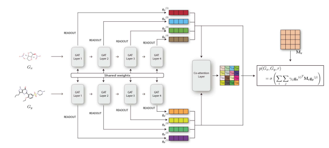
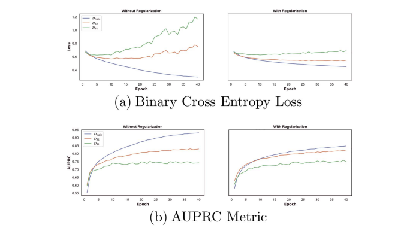
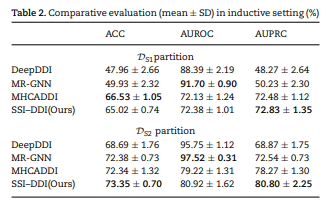
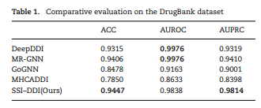

# Paper Review - 24

## **Paper Title**: SSI–DDI: substructure–substructure interactions for drug–drug interaction prediction
- Authors: Arnold K Nyamabo, Hui Yu, Jian-Yu Shi
- Published in ***Briefings in Bioinformatics, Volume 22, Issue 6, November 2021***
- Github: https://github.com/kanz76/SSI-DDI
---

## 🧾 Summary: 
The proposed model, SSI-DDI, is a knowledge-driven deep learning framework designed to predict adverse drug-drug interactions (DDIs). It operates directly on the raw molecular graph representations of drugs, allowing for richer feature extraction compared to manually engineered molecular representations. The model breaks down the DDI prediction task between two drugs into identifying pairwise interactions between their respective substructures. This approach takes into account that DDIs are fundamentally caused by chemical substructure interactions rather than considering the entire chemical structures of drugs.

## ⚙️ Architecture

The architecture of the SSI-DDI model involves several building blocks:

1. **Graph Convolution Operator:** The model utilizes Graph Neural Networks (GNNs), specifically Graph Attention Networks (GATs), to update the features of nodes in the molecular graphs. GAT layers perform convolution operations that aggregate information from adjacent nodes to update a node's features.

2. **Multi-head Attention:** To incorporate different representation subspaces and stabilize the learning process, the model employs multi-head attention mechanisms. These mechanisms apply linear transformations to each node using multiple attention heads, allowing for information from different subspaces to be considered.

3. **Chemical Substructure Extraction:** Convolution operations gather information about different substructures centered around nodes in the molecular graphs. As the model progresses through GAT layers, the size of the substructures grows. Attention mechanisms further refine the types of substructures being learned.

4. **Substructure Interaction Relevance with Co-Attention:** After extracting substructure information from the input drugs, the model uses a co-attention mechanism to determine the relevance of each pairwise interaction between the substructures of the drugs. This mechanism assigns importance scores to the interactions based on learnable weight matrices and a non-linearity function.

5. **Prediction and Loss Function:** The model predicts the probability of a DDI between the two drugs by considering the relevance of substructure interactions. A loss function is used to optimize the model's parameters during training.

Interestingly, the SSI-DDI model outperforms previous methods for DDI prediction and can be applied in an inductive setting (cold-start scenario), where it can make predictions on drugs that were not included in the training data. It also offers interpretability by providing relevance indices for each substructure interaction, enabling users to gain insight into the model's prediction results.

*However, there are some limitations to the SSI-DDI model. Performance may be affected when the order of drugs in DDIs is changed, even during the training phase. Additionally, noise in the substructure extraction phase can impact performance in the inductive setting. Future work will aim to address these limitations and further improve the model.*

## 📊 Results
**1. Performance Evaluation Metrics:** The evaluation of the experimental results was conducted using three metrics: accuracy (ACC), area under the receiver operating characteristic (AUROC), and area under the precision-recall curve (AUPRC). These metrics provide a comprehensive assessment of the performance of the different methods.

**2. Transductive Setting:** In the transductive setting, where the drugs in the test phase were also included in the training phase, the method being evaluated outperformed the others in terms of accuracy (ACC) and area under the precision-recall curve (AUPRC). This indicates that the method is able to distinguish between interacting and non-interacting drugs with high precision.

**3. Inductive Setting:** The evaluation also considered the inductive setting, which simulates a cold start problem where the model is presented with new drugs that it was not trained on. In this setting, the performance of the method decreased compared to the transductive setting, but it still exhibited good precision in distinguishing between interacting and non-interacting drug pairs, even for unseen drugs. It is worth noting that other baseline methods also experienced a drop in performance in the inductive setting.

**4. Comparison with Baseline Methods:** The method being evaluated showed competitive performance compared to the baseline methods in both the transductive and inductive settings. Specifically, it performed well in terms of AUROC, which is often affected by imbalanced datasets, while also achieving high AUPRC scores, indicating a high precision in identifying interacting drug pairs.

