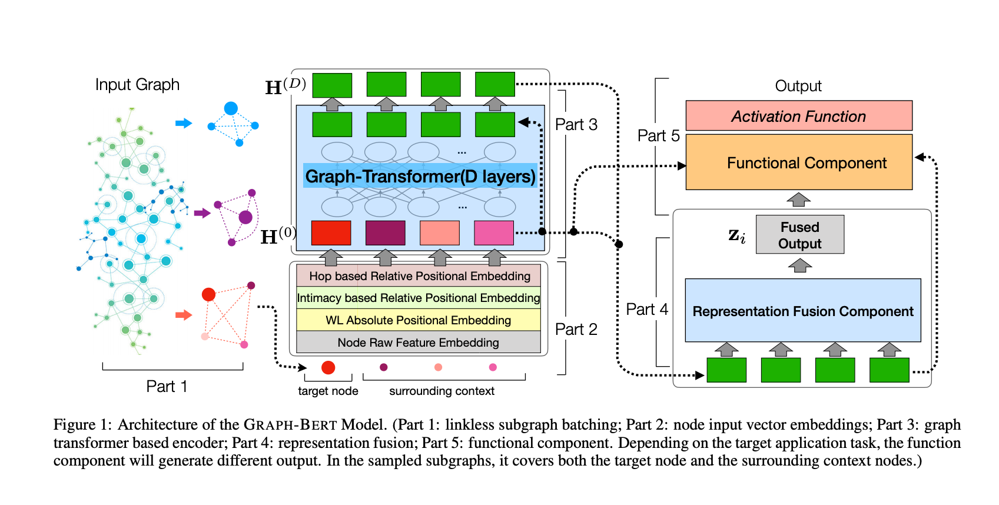
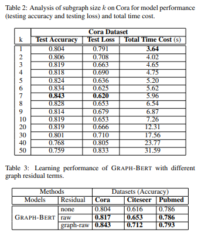
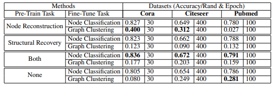

# Paper Review - 25

## **Paper Title**: GRAPH-BERT: Only Attention is Needed for Learning Graph Representations
- **Authors**: Jiawei Zhang, Haopeng Zhang, Congying Xia, Li Sun
- arxiv: https://arxiv.org/abs/2001.05140
---

## 🧾 Summary: 
The proposed model, GRAPH-BERT, is a new graph neural network (GNN) that addresses the limitations of existing GNNs, such as the suspended animation problem and over-smoothing problem, by solely relying on the attention mechanism without any graph convolution or aggregation operators. Unlike traditional GNNs that rely heavily on graph links, GRAPH-BERT is trained with sampled linkless subgraphs within local contexts, which enables more efficient learning. It can be trained in a standalone mode and later fine-tuned for specific tasks. The model is pre-trained using unsupervised learning with node attribute reconstruction and graph structure recovery tasks. The pre-trained GRAPH-BERT can be transferred and applied to different application tasks, making it a versatile and effective solution for graph representation learning. 

## ⚙️ Architecture

It consists of several key components: 
1. Linkless Subgraph Batching: Instead of processing the entire graph, GRAPH-BERT is trained on linkless subgraph batches sampled from the input graph. This enables efficient learning and makes it suitable for large-sized graphs.
2. Node Input Vector Embeddings: The model represents nodes using embeddings based on different factors like Weisfeiler-Lehman role embeddings, intimacy-based relative positional embeddings, and hop-based relative distance embeddings.
3. Graph Transformer-Based Encoder: GRAPH-BERT employs a graph-transformer based encoder to update node representations iteratively through multiple layers. This encoder helps capture both local and global structural information of the graph.
4. Representation Fusion: The results learned by the graph-transformer model are fused to form the final representations for target nodes.
5. Pre-training and Fine-tuning: GRAPH-BERT is pre-trained with unsupervised learning tasks, including node attribute reconstruction and graph structure recovery. It can then be fine-tuned for specific application tasks like node classification and graph clustering.

## 📊 Results
1. Learning Convergence: GRAPH-BERT converges quickly during training, even with deep architectures. Even with 50 layers, it maintains good learning performance without suffering from the suspended animation problem.
2. Main Results: GRAPH-BERT outperforms most of the baseline GNN models on node classification tasks, achieving significant improvements on Cora and Pubmed datasets and remaining among the top 3 performers on Citeseer.
3. Subgraph Size Analysis: The subgraph size parameter (k) significantly affects the learning performance of GRAPH-BERT. Small values of k (1 to 7) result in better performance, but overly large values degrade performance dramatically.
4. Graph Residual Analysis: GRAPH-BERT with graph-raw residual term performs better compared to other residual terms, in line with previous experimental observations.
5. Initial Embedding Analysis: Incorporating complementary embeddings, such as Weisfeiler-Lehman role embeddings, hop-based distance embeddings, and intimacy-based positional embeddings along with raw feature embeddings, enhances the performance of GRAPH-BERT compared to using raw feature embeddings alone.

6. Graph Clustering without Pre-Training: GRAPH-BERT achieves good results on graph clustering tasks without pre-training, using KMeans with nodes' raw feature vectors as input.
7. Pre-training vs. No Pre-training: Pre-training benefits GRAPH-BERT by providing a good initial state, leading to better performance with only a small number of fine-tuning epochs. Pre-training helps with node classification and graph clustering on Cora and Citeseer, but it slightly degrades results on graph clustering for Pubmed. Dual pre-training tasks lead to higher performance compared to single pre-training tasks.

