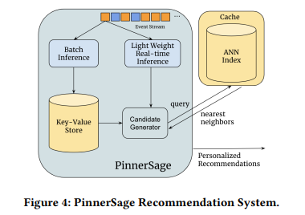

# Paper Review - Day 05

## **Paper Title**: PinnerSage: Multi-Modal User Embedding Framework for Recommendations at Pinterest
- **Authors**: Aditya Pal, Chantat Eksombatchai, Yitong Zhou, Bo Zhao, Charles Rosenberg, Jure Leskovec
- **Publication**: KDD 2020
- **arXiv**: https://arxiv.org/abs/2007.03634

---

---

## 🧾 Summary: 
The paper presents PinnerSage, a scalable and flexible recommender system deployed in production at Pinterest, that represents each user with multiple embeddings by clustering users' actions into conceptually coherent clusters via hierarchical clustering and uses an efficient nearest neighbor system to generate recommendations, resulting in high-quality personalized recommendations.

## 🖼️ Design Choices
In order to simplify the model and improve inference speed, they fixed some design chocies for the process to be smoother.
1. Pin embeddings are fixed to simplify the model, improve inference speed, and prevent undesirable side-effects of joint learning.
2. There is no restriction on the number of embeddings for users, allowing a more comprehensive understanding and avoiding merging unrelated concepts.
3. Clusters of user actions are represented by a medoid, which is a member of the original interacted pin set, ensuring topic coherence and robustness to outliers.
4. Medoid sampling is used for candidate retrieval, selecting a subset of important medoids for recommendation based on nearest neighboring pins.
5. Real-time updates are handled through a two-pronged approach: a daily batch job infers medoids based on long-term history, and an online version adapts to users' current activities, with the batch version resolving inconsistencies.

## 🚀How?
- Users' action pins from the last 90 days are clustered, ensuring that the clusters only combine conceptually similar pins. The importance score of each cluster is then computed based on relevance and recall metrics, providing insights into the user's preferences and the effectiveness of the recommendations.
- To cluster users' action pins from the last 90 days, two main constraints are imposed: clusters should combine only conceptually similar pins. Importance scores are computed for each cluster based on relevance and recall metrics. Relevance measures the proportion of observed action pins with high cosine similarity (≥ 0.8) to recommended pins, while recall determines the proportion of action pins found in the recommendation set. R-Precision (R-Prec.) indicates the proportion of action pins in the top-k ranking against impressions, serving as a measure of signal-to-noise ratio.

## ⚙️ Working Process
1. The main goal of PinnerSage is to recommend relevant content to users based on their past engagement history while also providing real-time recommendations.
2. To achieve this, PinnerSage utilizes a two-pronged approach, consisting of a daily batch inference on a MapReduce cluster and lightweight online inference based on the most recent user actions.
3. System optimization is crucial for the practical implementation of PinnerSage, resulting in significant cost reduction and the ability to independently improve each component of the architecture.

## 📊 Findings
- The paper conducts several offline and online A/B experiments to show that PinnerSage significantly outperforms single embedding methods. 
- The offline experiments show that PinnerSage outperforms single embedding methods in predicting the next user action. 
- The online A/B experiments show that PinnerSage leads to a significant increase in user engagement and satisfaction compared to the single embedding methods. 
- The paper also shows that the proposed clustering-based approach outperforms single embedding methods in predicting the next user action. 

## 👎 Limitations
The paper shows several limitations including the need for large training data, fixed pin embeddings, lack of analysis on computational complexity and interpretability, and limited discussion on fairness considerations. These limitations may restrict the applicability of the proposed method, particularly for smaller companies or startups, applications with specific embedding requirements, and those emphasizing interpretability and fairness.
