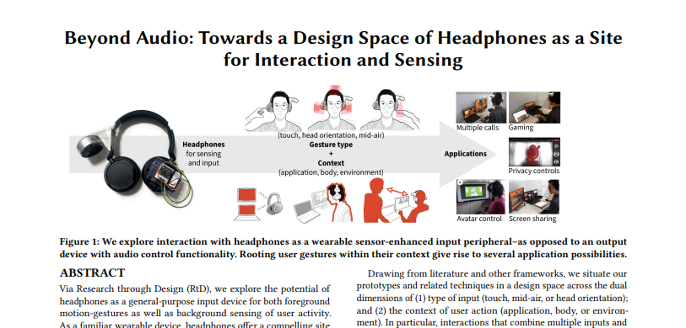
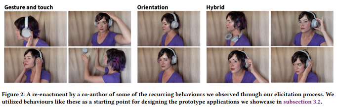
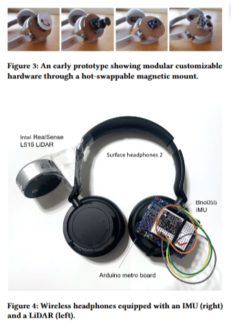
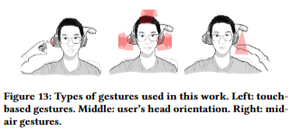

# Paper Review - Day 06

## **Paper Title**: Beyond Audio: Towards a Design Space of Headphones as a Site for Interaction and Sensing
- **Authors**: Payod Panda, M. Nicholas, David Nguyen, E. Ofek, M. Pahud, S. Rintel, Mar González-Franco, K. Hinckley, J. Lanier
- **Publication**: DIS'23: ACM Designing Interactive Systems Conference 2023 | ***BEST PAPER AWARD***
- **arXiv**: https://www.microsoft.com/en-us/research/uploads/prod/2023/05/dis23-64-2.pdf

---

---

## 🧾 Summary: 
- 🎧 The paper explores the concept of using headphones as a wearable sensor-enhanced input peripheral. Instead of being solely an output device for audio control, the authors explore the potential of capturing user input through head-worn devices. 
- 💡 It showcases prototype applications that utilize headphones in multi-device and cross-platform scenarios, highlighting their potential for interaction and sensing and paving the way for future research.

## 🖼️ Design Methodology
🔍 Research through Design methodology utilized to investigate headphones as input devices, uncovering cross-device interaction patterns, particularly in workplace and gaming contexts, through recordings of natural behaviors to encourage discussion.

- 💡 Researchers identified repeated gestures and interaction patterns in headphone design, such as lifting the earcup for conversation acceptance, and created an annotated portfolio to showcase their design decisions and philosophy.
- 🤝 Gesture-based interaction design for headphones explored, including socially accepted cues for conversation acceptance, evaluated through demonstration and an annotated portfolio.

## ⚙️ Prototypes
Early prototypes of their gesture-based interaction design involved adding sensors and input widgets like an IMU, buttons, and rotary encoders. They also developed a convenient hot-swappable magnetic mount for easy component swapping. Notably, these prototypes did not include mid-air gestures initially. However, subsequent iterations incorporated a LiDAR sensor positioned above the earcup, enabling the detection of mid-air gestures around the ear, extending down to the shoulder region.

## 📚 Human Interactions Analysis
The authors present an annotated portfolio showcasing functional prototypes of augmented headphones, highlighting the embedded interaction qualities. This demonstrates the advantages of using headphones as an input device for enhancing interaction across devices and platforms. By exploring headphones as wearable sensor-enhanced input peripherals rather than mere audio output devices, the authors uncover numerous application possibilities that arise from contextualizing user gestures.

## 🖐️ Input Gesture
The authors discuss input gestures for headphones, categorizing them as touch, grasp, and mid-air gestures, accounting for orientation-based sensors. According to Chen et al.'s gesture elicitation study, 58% of user-generated gestures were mid-air. The authors note that the choice of input gesture type can influence the user experience and the contextual use of the headphones.

## 🧠 Context of Input Gesture
They also discuss the contextual aspects of using headphones as an input device, highlighting the complexity of parsing naturalistic head motion combined with hand gestures. They propose three trigger-related factors: gesture type, location, and patterns, that should be considered in exploring headphone design. The authors also emphasize the extensibility of context of use, encompassing application, user's body, and environment, to other wearable devices. 

