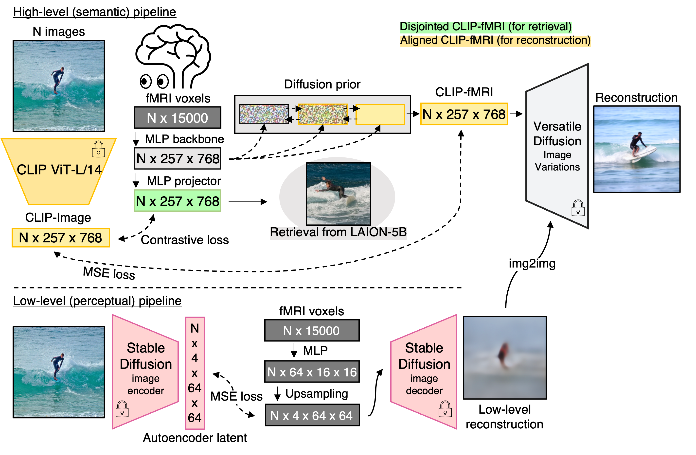
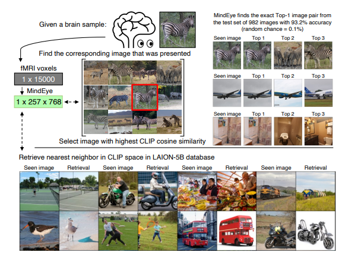
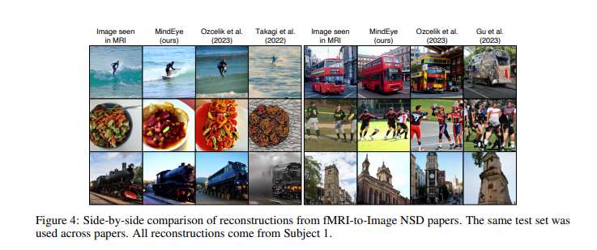

# Paper Review - Day 07 #2

## **Paper Title**: Reconstructing the Mind's Eye: fMRI-to-Image with Contrastive Learning and Diffusion Priors
- **Authors**: Paul S. Scotti, Atmadeep Banerjee, Jimmie Goode, Stepan Shabalin, Alex Nguyen, Ethan Cohen, Aidan J. Dempster, Nathalie Verlinde, Elad Yundler, David Weisberg, Kenneth A. Norman, Tanishq Mathew Abraham
- **arXiv**: https://arxiv.org/abs/2305.18274
- **Website (Stability.ai)** : https://stability.ai/research/minds-eye
- **Code (Github)** - https://github.com/medarc-ai/fmri-reconstruction-nsd

---

---

## 🧾 Summary: 
MindEye is a novel fMRI-to-image approach that retrieves and reconstructs viewed images from brain activity. It utilizes contrastive learning for retrieval and a diffusion prior for reconstruction, achieving state-of-the-art performance in both tasks. The model maps fMRI brain activity to a multimodal latent space, allowing accurate reconstruction and retrieval, even among similar images, and demonstrates improvements through specialized submodules, improved training techniques, and larger parameter models.

## 🖼️ Methodology
It maps fMRI brain activity to the latent space of a pretrained CLIP model, enabling high-accuracy image retrieval and reconstruction. The model's specialized submodules facilitate retrieval and reconstruction tasks, preserving fine-grained image-specific information in brain embeddings. By combining high-level semantic reconstruction and low-level perceptual reconstruction, MindEye achieves state-of-the-art performance in various image metrics.

## ⚙️ Architecture
In the MindEye model, there are two pipelines: a high-level semantic pipeline and a low-level perceptual pipeline. Both pipelines consist of a residual MLP backbone and task-specific submodules. The high-level pipeline uses an MLP projector and diffusion prior, while the low-level pipeline uses an MLP projector and CNN decoder. Training the projector submodule with contrastive loss and the second submodule with mean squared error (MSE) loss yields the best performance in both pipelines.

It employs large-scale multilayer perceptrons, contrastive learning, and diffusion models to achieve state-of-the-art image reconstruction. With specialized submodules for retrieval and reconstruction, MindEye achieves high accuracy in image retrieval and brain retrieval tasks, surpassing previous methods. It demonstrates the presence of fine-grained image-specific information in brain embeddings and shows potential for scalability to large-scale databases. The model combines high-level semantic reconstruction with low-level perceptual reconstruction, resulting in state-of-the-art performance across various image metrics.

## 📊 Findings 
- Image/Brain Retrieval
  - MindEye achieves an impressive 93.2% accuracy in retrieving the exact original image from brain samples, demonstrating the retention of fine-grained exemplar-level information in CLIP fMRI embeddings. The model outperforms similar approaches by a significant margin in both image retrieval and brain retrieval tasks, showcasing its superior performance. 

- fMRI-to-Image Reconstruction
  - MindEye achieves state-of-the-art image reconstructions compared to other fMRI-to-image reconstruction models. Quantitative evaluations and comparisons show superior performance in terms of image quality and fidelity. The model demonstrates high accuracy in two-way identification, correctly identifying original image embeddings from paired brain embeddings with excellent results.
  
