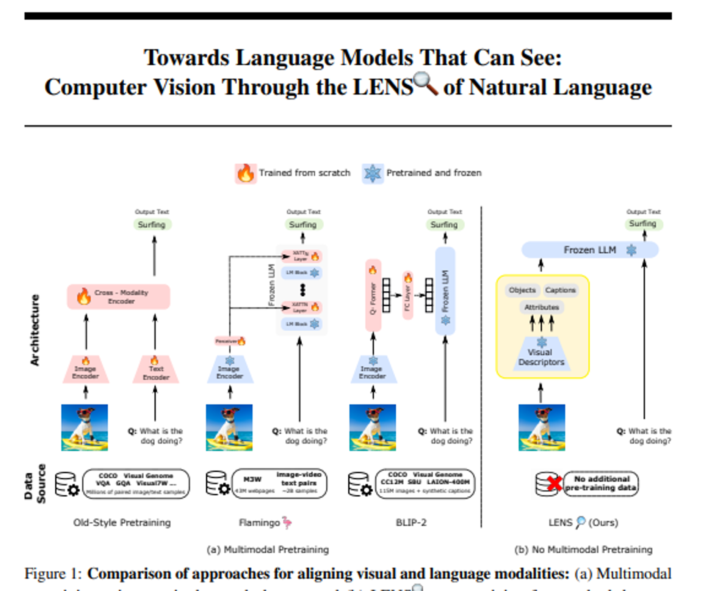
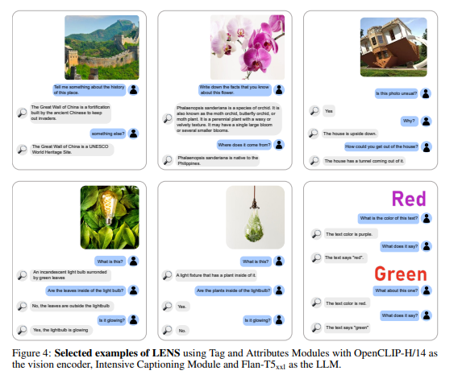
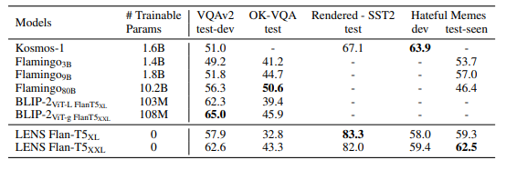
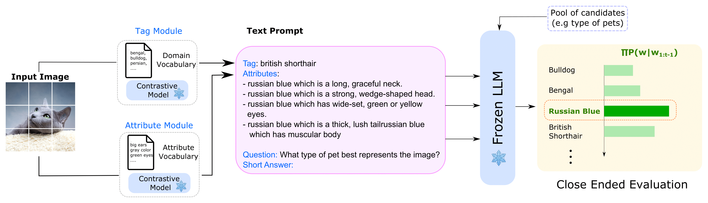
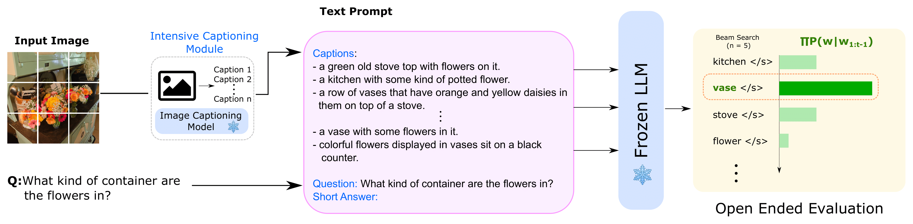

# Paper Review - Day 08

## **Paper Title**: Towards Language Models That Can See: Computer Vision Through the LENS of Natural Language
- **Authors**: William Berrios, Gautam Mittal, Tristan Thrush, Douwe Kiela, Amanpreet Singh
- **arXiv**: https://arxiv.org/abs/2306.16410
- **Code (Github)** - https://github.com/ContextualAI/lens

---

---

## 🧾 Summary: 
- 👓 LENS (Large Language Models Enhanced to See) is a modular approach that combines the power of language models with independent vision modules to tackle computer vision problems effectively.
- 🌟 LENS eliminates the need for multimodal pretraining or additional data, bridging the gap between vision and language at zero cost by providing a unified framework where a LLM's reasoning module operates on textual data extracted from independent vision modules
- 💡 By integrating LENS, we can benefit from the latest advancements in computer vision and natural language processing without domain-specific pretraining.
- 📊 Experimental results demonstrate that LENS achieves competitive or superior performance compared to end-to-end pre-trained models like Kosmos and Flamingo, even in zero-shot scenarios.

## ⚙️ Architecture
The LENS framework consists of three vision modules: Tag Module for image tagging, Attributes Module for assigning relevant attributes to objects, and Intensive Captioner for generating diverse captions. These vision modules extract textual information from images using encoders like CLIP and BLIP. The reasoning module, a frozen LLM, uses the textual descriptions from the vision modules along with task-specific instructions to generate answers. LENS integrates with any black box LLM, providing a streamlined approach to enhance their vision capabilities.

## 📊 Findings 

- Object Recognition
  - The experimental results demonstrate that in object recognition tasks, LENS composed of ViT-H/14 as the visual backbone and Flan-T5xxl as the frozen LLM outperforms an equal-size CLIP with a common prompt, showing an average improvement of +0.7% in zero-shot scenarios. Interestingly, the size of the frozen LLM does not directly correlate with classification performance, but there is a relationship between the performance and the size of the tagger architecture (ViT backbone). Additionally, the results show that increasing the number of shots improves performance regardless of the visual backbone and frozen LLM combination.

- Vision and Language
  - LENS performs competitively against larger and more sophisticated systems like Flamingo, BLIP-2, and Kosmos in vision and language tasks. LENS achieves superior performance in VQA 2.0 compared to Flamingo and Kosmos, outperforms various versions of Flamingo and Kosmos in different benchmarks, and matches the performance of BLIP-2 in intensive captioning. However, LENS falls slightly behind Flamingo in OK-VQA, potentially due to the larger knowledge base of Flamingo's language model.
  

# 👎 Limitations
LENS has limitations in terms of its reliance on underlying vision components for performance improvement and the requirement of substantial computational resources for evaluation, but efforts should be made to enhance integration between vision and language components and make computational resources more accessible.

