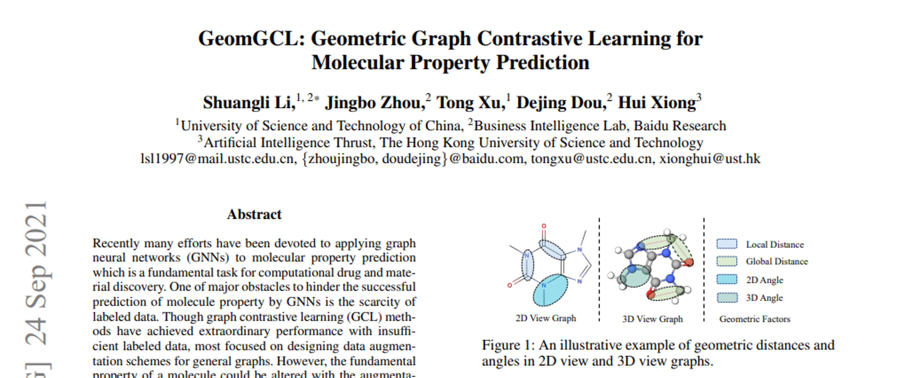
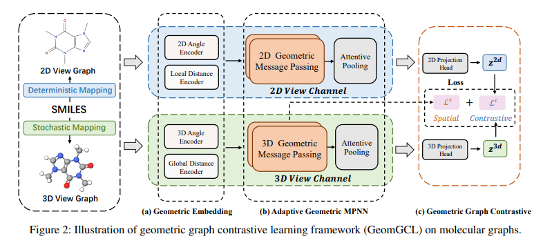
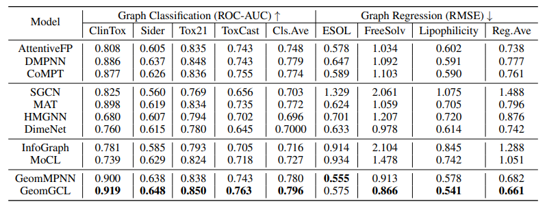

# Paper Review - 10

## **Paper Title**: GeomGCL: Geometric Graph Contrastive Learning for Molecular Property Prediction
- **Authors**: Shuangli Li, Jingbo Zhou, Tong Xu, Dejing Dou, Hui Xiong
- **arXiv**: https://arxiv.org/abs/2109.11730
- **Code (Github)** - https://github.com/agave233/GeomGCL

---

---

## 🧾 Summary: 
GeomGCL is a novel graph contrastive learning method that incorporates molecular geometry across 2D and 3D views for molecular property prediction. It introduces the GeomMPNN, a dual-view geometric message passing network, to leverage rich information from both graph representations. A geometric graph contrastive scheme is designed to enhance the generalization ability of GeomMPNN. Experimental results demonstrate the effectiveness of GeomGCL on various molecular property prediction tasks.

## ⚙️ Architecture
In the proposed GeomGCL method, geometric embeddings are calculated using definite geometric factors like distance and angle. Radial basis functions are used to obtain dual-level geometric embeddings for both 2D and 3D views of molecules. An adaptive geometric message passing network (GeomMPNN) is designed to learn the topological structures of molecules based on the geometric information. The GeomMPNN consists of Node→Edge, Edge→Edge, and Edge→Node message passing layers, followed by a Node→Graph attentive pooling process. The geometric contrastive optimization is achieved by mapping the representations of 2D and 3D views into a shared space and optimizing a contrastive loss function.

## 📊 Findings 
The results show that incorporating geometric information through dual-channel embeddings and adaptive message passing improves molecular representation learning by effectively captures geometry-aware structural information by contrasting 2D and 3D geometric views, overcoming the limitations of models that rely solely on chemical features. It scores ~91% in CinTox dataset, graph classification.
  

